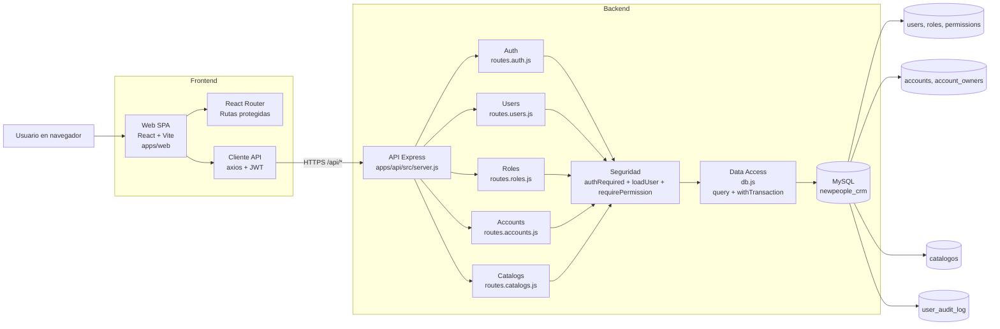
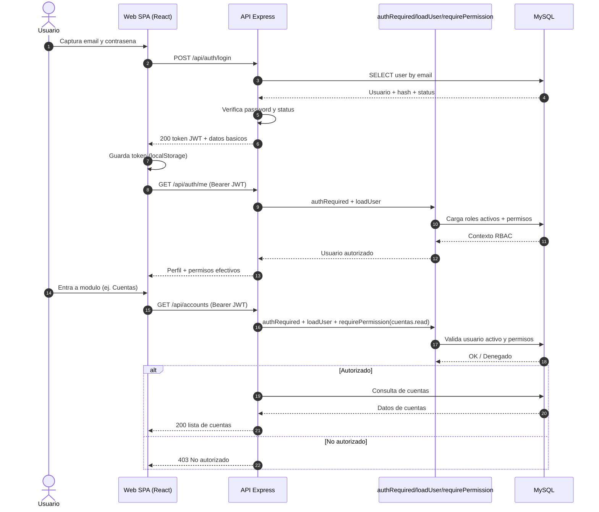

# Arquitectura de la aplicacion

Este documento describe la arquitectura tecnica de NewPeople CRM a nivel de
repositorio, capas, modulos, datos, seguridad y flujos de operacion.

## 1. Vision general

NewPeople CRM es un monorepo con dos aplicaciones principales:

- API backend: Node.js + Express + MySQL.
- Web frontend: React + Vite + React Router.

Objetivo actual:

- Gestionar autenticacion y autorizacion (RBAC).
- Administrar usuarios, roles/permisos y cuentas.
- Mantener catalogos maestros para cuentas.

## 2. Topologia del monorepo

Estructura principal:

- package.json (raiz): orquestacion de workspaces y scripts globales.
- apps/api: servicio HTTP backend.
- apps/web: cliente SPA.
- readme: documentacion funcional y tecnica.

### 2.1 Esquema visual de arquitectura

### 2.2 Esquema de secuencia (login y acceso a modulos)

Scripts clave en raiz:

- npm run dev: levanta API y Web en paralelo.
- npm run dev:api: levanta solo API.
- npm run dev:web: levanta solo Web.
- npm run build:web: build de produccion de la SPA.

## 3. Arquitectura de despliegue (logica)

1. Navegador carga SPA (apps/web).
2. SPA consume API REST en /api/\*.
3. API valida JWT, resuelve contexto RBAC y ejecuta logica de negocio.
4. API persiste/consulta en MySQL mediante pool y transacciones.

Servicios y puertos por defecto:

- Web: http://localhost:5173
- API: http://localhost:4000
- DB: MySQL (configurable por .env)

## 4. Backend: arquitectura por capas

### 4.1 Capa de entrada HTTP

Archivo principal: apps/api/src/server.js

Responsabilidades:

- Inicializar Express.
- Configurar middleware global (CORS + JSON).
- Exponer endpoint de salud (/health).
- Montar rutas por dominio bajo /api.
- Manejo global de errores (500).

Ruteo montado:

- /api/auth (publico y semipublico segun endpoint).
- /api/users (protegido).
- /api/roles (protegido).
- /api/accounts (protegido).
- /api/catalogs (protegido).

## 4.2 Capa de configuracion

Archivo: apps/api/src/config.js

Centraliza:

- Puerto API.
- JWT secret y expiracion.
- Config de aplicacion (URL de set-password).
- Config SMTP.
- Config de MySQL pool.

## 4.3 Capa de acceso a datos

Archivo: apps/api/src/db.js

Primitivas:

- query(sql, params): consulta simple con pool.
- withTransaction(work): unidad transaccional con commit/rollback.

Uso recomendado:

- query para lecturas y escrituras simples.
- withTransaction para operaciones compuestas (ejemplo: cuenta + propietarios,
  primer usuario + rol admin, actualizacion de cuenta con reemplazo de owners).

## 4.4 Capa de seguridad (AuthN/AuthZ)

Archivo: apps/api/src/auth.js

Flujo:

1. authRequired:

- Extrae Bearer token.
- Verifica JWT.
- Rechaza 401 si falta o es invalido/expirado.

2. loadUser:

- Resuelve contexto de usuario desde DB.
- Carga roles activos y permisos efectivos.
- Bloquea usuario inactivo (403).

3. requirePermission(permission):

- Autoriza por permiso explicito.
- Bypass para rol Administrador.
- Deny-by-default con 403 cuando no cumple.

Modelo de autorizacion:

- Usuario -> user_roles -> roles.
- Rol -> role_permissions -> permissions.
- Solo roles activos aportan permisos.

## 4.5 Capa de utilidades transversales

Archivo: apps/api/src/utils.js

Funciones:

- signToken: emite JWT con sub/email/name.
- normalizeEmail: estandarizacion de email.
- sendUserInvitationEmail: envio SMTP para invitacion/reinicio.

Comportamiento resiliente SMTP:

- Si no hay config SMTP valida, no rompe flujo de negocio.
- Responde como "pendiente" y registra advertencia.

## 4.6 Capa de dominio (rutas por modulo)

### Auth (apps/api/src/routes.auth.js)

Endpoints:

- GET /api/auth/bootstrap-status
- POST /api/auth/register-first
- POST /api/auth/login
- GET /api/auth/me

Notas de arquitectura:

- register-first es transaccional y crea el primer admin.
- login actualiza last_visit_at.
- /me retorna contexto de permisos y roles para UI.

### Users (apps/api/src/routes.users.js)

Endpoints principales:

- GET /api/users
- POST /api/users
- PUT /api/users/:id
- PATCH /api/users/:id/status
- POST /api/users/:id/reset-password-invite
- GET /api/users/audit
- POST /api/users/test-invite-email

Notas:

- Validacion de payload con zod.
- Auditoria de usuario en user_audit_log para create/update/status/reset.
- Creacion de usuario con password temporal y flujo de invitacion.

### Roles (apps/api/src/routes.roles.js)

Endpoints principales:

- GET /api/roles
- POST /api/roles
- PATCH /api/roles/:id/status
- GET /api/roles/permissions
- GET /api/roles/:id/permissions
- PUT /api/roles/:id/permissions
- GET /api/roles/:id/users

Notas:

- Soporta includeInactive en listado.
- Protege roles de sistema frente a desactivacion.
- Actualiza metadatos de auditoria en cambios de permisos/estado.

### Accounts (apps/api/src/routes.accounts.js)

Endpoints principales:

- GET /api/accounts
- GET /api/accounts/:id
- POST /api/accounts
- PUT /api/accounts/:id
- PATCH /api/accounts/:id/status

Notas:

- Validacion con zod.
- ownerUserIds obligatorio (min 1).
- Creacion y actualizacion de owners con transaccion.
- Estado se cambia por statusCode: activada/desactivada.

### Catalogs (apps/api/src/routes.catalogs.js)

Endpoints:

- GET /api/catalogs/countries
- GET /api/catalogs/currencies
- GET /api/catalogs/account-types
- GET /api/catalogs/economic-sectors
- GET /api/catalogs/account-activation-statuses

Notas:

- Todos filtrados por is_active = 1.
- Requieren permiso cuentas.read.

## 5. Frontend: arquitectura funcional

## 5.1 Bootstrap y shell

Archivos:

- apps/web/src/main.jsx
- apps/web/src/App.jsx
- apps/web/src/api.js

Flujo inicial:

1. App consulta /api/auth/bootstrap-status.
2. Si no hay usuarios, muestra FirstUserSetup.
3. Si hay token, configura Authorization global (axios) y consulta /api/auth/me.
4. Si no hay sesion valida, muestra Login.
5. Si hay sesion, renderiza Shell + rutas privadas por permisos.

## 5.2 Cliente HTTP

Archivo: apps/web/src/api.js

- Axios instance con baseURL configurable.
- setAuthToken para header Authorization.
- getApiErrorMessage para estandarizar errores en UI.

## 5.3 Navegacion y proteccion de vistas

Definida en App.jsx via React Router.

Regla:

- Cada ruta se muestra solo si currentUser tiene permiso.
- Si no tiene, redirecciona a dashboard.

Rutas:

- /
- /users
- /roles
- /accounts

## 5.4 Modulo Usuarios (frontend)

Patrones aplicados:

- Tabla con ordenamiento por columnas y flechas.
- Buscador de lista.
- Badge de estado.
- Menu de acciones por fila.
- Modal de creacion.
- Modal de edicion con auditoria compacta.
- Seccion de auditoria de eventos con filtros avanzados.

## 5.5 Modulo Roles (frontend)

Patrones aplicados:

- Lista de roles con badge y conteos.
- Filtro para incluir desactivados.
- Modal de creacion.
- Asignacion de permisos por checkbox grid.
- Lista de usuarios por rol seleccionado.
- Panel de auditoria del rol.

## 5.6 Modulo Cuentas (frontend)

Patrones aplicados:

- Lista con filtro de desactivadas (por defecto solo activadas).
- Busqueda + ordenamiento por columnas con flechas.
- Badge de estado activada/desactivada.
- Menu de acciones por fila (editar/activar/desactivar).
- Modal unificado para crear/editar.
- Formulario seccionado.
- Propietarios con doble vista:
  seleccionados + lista scrolleable.
- Auditoria de cuenta en edicion.

## 6. Modelo de datos (resumen)

Entidades nucleares:

- users
- roles
- permissions
- user_roles
- role_permissions
- accounts
- account_owners
- user_audit_log

Catalogos:

- countries
- currencies
- country_currency
- account_types
- economic_sectors
- account_activation_statuses

Relaciones relevantes:

- users N:M roles (user_roles)
- roles N:M permissions (role_permissions)
- accounts N:M users (account_owners)
- accounts -> account_types/economic_sectors/countries/account_activation_statuses
- accounts.created_by / updated_by -> users
- user_audit_log -> users (actor y afectado)

## 7. Convenciones de errores y mensajes

Backend:

- Validacion fallida: 400 + "Datos invalidos" + flatten() de zod.
- No autorizado: 403.
- No autenticado: 401.
- No encontrado: 404.
- Error interno: 500.

Frontend:

- Traduce errores con getApiErrorMessage.
- Usa toasts de exito/error auto ocultables.
- Prioriza errores de campo cuando backend los envia.

## 8. Seguridad y cumplimiento de acceso

- JWT obligatorio en todos los modulos de negocio.
- Usuario inactivo bloqueado en middleware.
- RBAC con evaluacion por permiso y excepcion admin.
- Deny-by-default como postura por defecto.

## 9. Rendimiento y escalabilidad actual

Fortalezas:

- Pool de conexiones DB.
- Separacion clara por rutas/modulos.
- Catalogos cacheables del lado cliente.

Limites actuales:

- Sin paginacion en listados principales.
- Algunas consultas usan agregaciones no paginadas.
- App.jsx concentra mucha logica de presentacion.

Recomendaciones de evolucion:

- Extraer hooks por dominio (useUsers/useAccounts/useRoles).
- Fragmentar componentes de tablas y modales.
- Introducir paginacion y filtros server-side si crece volumen.
- Versionar API cuando aumente superficie funcional.

## 10. Operacion y observabilidad

- /health valida disponibilidad API + consulta DB NOW(3).
- Logs de error backend por consola.
- SMTP sin config no tumba endpoints de invitacion.

Siguientes mejoras sugeridas:

- Logging estructurado con request-id.
- Metricas de latencia y errores por endpoint.
- Trazas para operaciones transaccionales.

## 11. Guia de extensibilidad para nuevos modulos

Para nuevos modulos (ejemplo Contactos/Oportunidades):

1. DB:

- Crear tablas + FKs + indices + seed de catalogos si aplica.

2. Backend:

- Crear route file dedicado.
- Validar payloads con zod.
- Proteger con requirePermission.
- Reutilizar withTransaction en operaciones compuestas.

3. Frontend:

- Seguir patron comun de listas y edicion documentado en:
  readme/patron-comun-listas-y-edicion.md
- Reusar toasts, sort-header-btn y badges de estado.

4. Permisos:

- Crear permisos modulo.read/create/update.
- Asignar a roles desde gestion de roles.

## 12. Anexo: mapa rapido de archivos

Backend (apps/api/src):

- server.js: bootstrap HTTP y montaje de rutas.
- config.js: configuracion central.
- db.js: pool y transacciones.
- auth.js: autenticacion/autorizacion.
- utils.js: JWT, email, helpers comunes.
- routes.auth.js: primer usuario, login, me.
- routes.users.js: usuarios, estado, invitaciones, auditoria.
- routes.roles.js: roles, permisos, estado, usuarios por rol.
- routes.accounts.js: cuentas, owners, estado.
- routes.catalogs.js: catalogos maestros.

Frontend (apps/web/src):

- main.jsx: entrypoint React.
- api.js: cliente HTTP y helper de errores.
- App.jsx: shell, rutas y modulos de UI.
- index.css: sistema de estilos de la SPA.

SQL:

- apps/api/sql/schema.sql: esquema completo + semillas iniciales.
