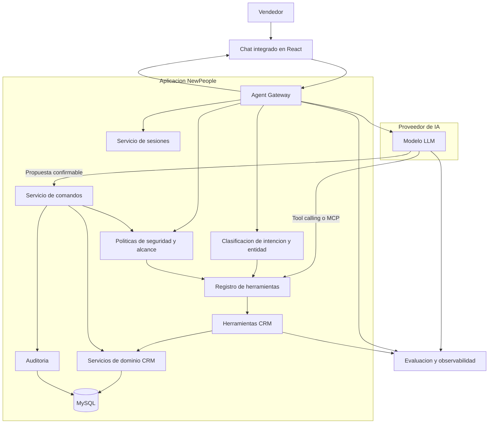
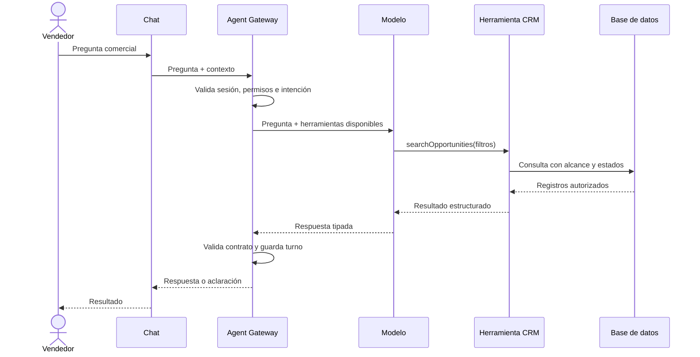

# Arquitectura del Chat Coach

Este documento define la arquitectura objetivo para que Mi Coach funcione como un asesor comercial confiable para el vendedor. Describe la diferencia frente a la implementación actual, las responsabilidades de cada capa, los límites del agente y una ruta de evolución incremental.

## 1. Objetivo

Mi Coach debe ayudar al vendedor a:

- Consultar cuentas, oportunidades, contactos, actividades y pipeline.
- Entender riesgos, pendientes y próximos pasos comerciales.
- Resolver preguntas usando datos autorizados y actuales del CRM.
- Proponer acciones comerciales sin ejecutarlas de forma implícita.
- Mantener el contexto de la conversación sin mezclar cuentas, oportunidades o usuarios.
- Pedir una aclaración útil cuando existan varias coincidencias.

El objetivo no es construir un chat que tenga acceso indiscriminado al CRM. El objetivo es construir un agente comercial que razone sobre resultados confiables obtenidos mediante herramientas controladas.

## 2. Principios de diseño

### 2.1 El CRM es la fuente de verdad

El modelo de IA no consulta MySQL directamente, no decide permisos y no determina por sí mismo si un registro está activo, desactivado, ganado, perdido o en una etapa específica.

La aplicación debe ser responsable de:

- Autenticación y autorización.
- Ownership y alcance comercial.
- Estados y etapas del proceso.
- Relaciones entre cuentas, oportunidades, contactos y leads.
- Escrituras, transacciones e idempotencia.
- Auditoría.

### 2.2 El modelo razona; las herramientas verifican

El modelo debe interpretar el lenguaje del vendedor y elegir la herramienta correcta. Las herramientas deben consultar datos reales y devolver resultados estructurados.

No se debe enviar un snapshot indiscriminado esperando que el modelo descubra todas las relaciones comerciales por texto libre.

### 2.3 La interfaz no debe reinterpretar al agente

El backend debe devolver respuestas estructuradas. React debe renderizar esas respuestas, no reconstruir una aclaración distinta ni volver a clasificar candidatos como cuentas, oportunidades o leads.

### 2.4 Consultar y modificar son flujos diferentes

Las consultas pueden resolverse directamente con datos autorizados. Las modificaciones siempre requieren:

1. Propuesta estructurada.
2. Confirmación explícita del vendedor.
3. Validación de permisos y versión.
4. Ejecución idempotente.
5. Auditoría.

### 2.5 Los errores deben ser visibles y recuperables

Cuando el agente no pueda resolver una entidad, debe explicar qué falta y mostrar opciones diferenciadas. No debe seleccionar una entidad parecida por su cuenta ni cambiar silenciosamente de oportunidad a lead.

## 3. Arquitectura actual

La implementación actual ya contiene piezas útiles, pero varias responsabilidades están concentradas en pocos módulos:

- `apps/web/src/MiAgentPage.jsx` administra interfaz, estado del chat, contexto, restauración de sesiones, aclaraciones y operaciones.
- `apps/api/src/routes.mi-agent.js` concentra construcción de contexto, consultas del CRM, ejecución de jobs, interacción con IA, normalización de respuestas y rutas de operaciones.
- `apps/api/src/coach/entity-resolver.js` intenta resolver cuentas, oportunidades, contactos y leads a partir del texto.
- `apps/api/src/coach/service.js` persiste sesiones y operaciones pendientes.
- `apps/api/test` y `apps/web/e2e` cubren varios flujos, pero la cobertura de preguntas reales todavía debe ampliarse.

### 3.1 Limitaciones actuales

- La resolución de entidades depende demasiado de coincidencias textuales.
- Las oportunidades se buscan principalmente por su nombre, aunque el vendedor suele referirse a la cuenta asociada.
- Leads y oportunidades pueden competir como candidatos aunque la pregunta mencione explícitamente una oportunidad.
- Un snapshot grande mezcla datos de varios dominios y estados.
- La consulta, el razonamiento, la normalización y la ejecución están acoplados en la misma ruta.
- El frontend puede generar aclaraciones propias a partir del estado local.
- La sesión persiste en backend, pero el navegador también conserva el identificador y participa en la restauración.
- Las operaciones pendientes complican acciones simples como limpiar una conversación.
- Los casos de ambigüedad, duplicados, ownership y estados inactivos requieren pruebas específicas para no regresar.

## 4. Arquitectura objetivo

## 5. Componentes

### 5.1 Chat integrado

La interfaz debe ser una proyección del estado del agente. Sus responsabilidades son:

- Capturar la pregunta.
- Mostrar mensajes y resultados.
- Mostrar candidatos de una aclaración estructurada.
- Mostrar propuestas de acción.
- Solicitar confirmación.
- Mostrar errores, estado de carga y operaciones pendientes.

La interfaz no debe:

- Consultar directamente tablas del CRM.
- Decidir si una coincidencia es una oportunidad o un lead.
- Deducir estados comerciales.
- Rehacer la lógica de resolución del backend.

### 5.2 Agent Gateway

Es el punto de entrada único para las conversaciones del Coach. Debe:

- Cargar la sesión del usuario.
- Recibir la pregunta y el contexto explícito.
- Validar el formato de entrada.
- Coordinar la resolución de intención y entidades.
- Entregar al modelo únicamente herramientas disponibles para ese usuario.
- Validar la respuesta estructurada del modelo.
- Guardar el turno y el contexto resultante.
- Devolver un contrato estable al frontend.

El Gateway no debe convertirse en una nueva ruta monolítica. La consulta, resolución, comandos y persistencia deben estar separados por servicio.

### 5.3 Clasificación de intención y entidad

Antes de consultar datos se deben identificar:

- Tipo de solicitud: consulta, preparación, recomendación o acción.
- Entidad principal: cuenta, oportunidad, contacto, lead, actividad o pipeline.
- Entidades relacionadas.
- Filtros: etapa, estado, monto, fecha, riesgo o vendedor.
- Necesidad de aclaración.

Regla obligatoria:

> Si el vendedor menciona "oportunidad", no se deben ofrecer leads como sustitutos silenciosos.

Para una pregunta como "¿Cuál es la oportunidad de Totalplay que está en waiting?", el proceso esperado es:

1. Entidad principal: oportunidad.
2. Cuenta relacionada: Totalplay.
3. Etapa solicitada: waiting.
4. Alcance: oportunidades visibles para el vendedor.
5. Estado de activación: activada, salvo que se solicite lo contrario.
6. Resultado: una oportunidad o una lista diferenciada de oportunidades.

### 5.4 Herramientas CRM

Las herramientas deben ser pequeñas, explícitas y comprobables. Ejemplos:

- `searchAccounts`.
- `searchOpportunities`.
- `getOpportunity`.
- `getOpportunityActivities`.
- `getSellerPipeline`.
- `searchContacts`.
- `searchLeads`.
- `prepareActivity`.
- `createActivity`.

Cada herramienta debe:

- Recibir parámetros tipados.
- Aplicar permisos y ownership en el servidor.
- Aplicar filtros de activación y estado de forma explícita.
- Devolver IDs y relaciones completas.
- No devolver duplicados.
- Indicar si el resultado está vacío, es único o es ambiguo.

### 5.5 Servicio de comandos

Todas las escrituras pasan por un servicio separado del flujo de consulta.

Responsabilidades:

- Validar permisos nuevamente.
- Validar que la entidad siga vigente.
- Validar versión o control de concurrencia.
- Ejecutar dentro de transacción cuando corresponda.
- Aplicar idempotencia.
- Registrar auditoría.
- Devolver el resultado real de la operación.

El modelo puede proponer un comando, pero nunca ejecutarlo directamente.

### 5.6 Servicio de sesiones

El servidor debe ser la fuente de verdad de la conversación.

Una sesión debe conservar:

- Usuario.
- Contexto seleccionado.
- Historial normalizado.
- Entidades resueltas.
- Pregunta pendiente.
- Aclaración activa.
- Operaciones pendientes.
- Versión y timestamps.
- Estado activo o cerrado.

El `localStorage` puede conservar una referencia auxiliar, pero no debe poder restaurar una sesión que el servidor considera cerrada.

## 6. Contrato de respuestas

El agente debe devolver un tipo de respuesta estable:

- `informational`: respuesta informativa.
- `clarification`: faltan datos o existen varias coincidencias.
- `recommendation`: recomendación comercial sustentada.
- `action_proposal`: propuesta de modificación.
- `error`: error recuperable o no recuperable.

Una aclaración debe contener:

- Mensaje.
- Tipo de entidad esperado.
- Motivo de la ambigüedad.
- Solicitud original.
- Candidatos.
- Identidad completa de cada candidato.
- Acción que continuará después de seleccionar.

Cada candidato debe incluir, según corresponda:

- `entityType`.
- `id`.
- `name`.
- `accountId`.
- `accountName`.
- `stageCode` y `stageName`.
- Estado de activación.
- Estado comercial.
- Monto.
- Fecha de cierre.

Los candidatos se deben deduplicar por `entityType` e `id` antes de enviarlos al frontend.

## 7. Seguridad y alcance

El modelo no debe recibir ni decidir el alcance completo del CRM. Cada herramienta debe aplicar:

- Permisos del usuario.
- Ownership de cuentas y oportunidades.
- Permisos globales de lectura cuando existan.
- Estado activo del registro.
- Restricciones de módulo.
- Campos sensibles permitidos.

El resultado debe distinguir entre:

- Registro inexistente.
- Registro existente pero fuera del alcance.
- Registro desactivado.
- Registro accesible pero ambiguo.

La ausencia de un registro en una herramienta no debe convertirse automáticamente en una afirmación de que el registro no existe en todo el CRM.

## 8. Flujos principales

### 8.1 Consulta única

### 8.2 Aclaración

Si existen varias coincidencias:

1. El backend devuelve candidatos del tipo correcto.
2. El frontend muestra información diferenciadora.
3. El vendedor selecciona un candidato.
4. El backend actualiza el contexto.
5. El agente continúa la solicitud original.

No se debe reiniciar la conversación ni cambiar la entidad principal durante este flujo.

### 8.3 Acción comercial

1. El vendedor solicita una acción.
2. El agente consulta la entidad y los datos requeridos.
3. El agente propone la acción con valores visibles.
4. El vendedor confirma.
5. El servicio de comandos valida permisos y versión.
6. Se ejecuta la operación.
7. Se registra auditoría.
8. El agente informa el resultado real.

## 9. Estados y reglas CRM

El Coach debe consumir catálogos únicos para:

- Activación de oportunidades.
- Estados comerciales.
- Etapas de venta.
- Estado de actividades.
- Estado de leads.

Las reglas deben ser explícitas:

- Las oportunidades desactivadas no aparecen en el pipeline normal.
- Las oportunidades históricas no se mezclan con oportunidades abiertas.
- Una etapa `waiting` debe tratarse como código, no como coincidencia textual.
- Un lead no es una oportunidad.
- Una cuenta puede ser el criterio de búsqueda de una oportunidad sin convertirse en la entidad principal.
- Los registros con nombres iguales deben diferenciarse por ID, cuenta, monto o fecha.

## 10. Observabilidad y calidad

Cada turno debe poder rastrearse con:

- Usuario.
- Sesión.
- Pregunta original.
- Intención detectada.
- Herramientas utilizadas.
- Parámetros no sensibles.
- IDs consultados.
- Resultado estructurado.
- Latencia.
- Errores.
- Acción ejecutada, si hubo confirmación.

Debe existir un conjunto de evaluación con preguntas reales del vendedor. Como mínimo:

- Oportunidad por cuenta y etapa.
- Cuenta con varias oportunidades.
- Oportunidad desactivada.
- Lead con nombre parecido a una cuenta.
- Usuario sin ownership.
- Registro fuera de alcance.
- Consulta sin resultados.
- Acción con campos faltantes.
- Acción pendiente y limpieza de sesión.
- Respuesta tardía después de cambiar de contexto.

Cada caso debe tener una expectativa estructurada, no solo una comparación textual de la respuesta.

## 11. Diferencia frente a la implementación actual

| Responsabilidad | Implementación actual | Arquitectura objetivo |
| --- | --- | --- |
| Contexto | Snapshot amplio del CRM | Herramientas específicas bajo demanda |
| Resolución | Coincidencias textuales entre varios dominios | Intención y entidad separadas, con reglas de dominio |
| Oportunidades | Principalmente búsqueda por nombre | Búsqueda por nombre, cuenta, etapa y estado |
| Leads | Pueden competir con oportunidades | Solo se consultan cuando la intención lo indica |
| Frontend | Puede construir aclaraciones propias | Renderiza contratos del backend |
| Acciones | Mezcladas con conversación | Servicio de comandos separado |
| Sesión | Backend más referencia en navegador | Backend como fuente de verdad |
| Permisos | Distribuidos entre rutas y consultas | Aplicados dentro de cada herramienta y comando |
| Calidad | Pruebas por funcionalidad | Evaluación continua con preguntas reales |

## 12. Ruta de transición

### Fase 1: estabilizar consultas

- Definir contratos de respuesta.
- Separar oportunidades, cuentas, contactos y leads.
- Implementar herramientas de solo lectura.
- Resolver búsquedas por cuenta, etapa y estado.
- Eliminar aclaraciones reconstruidas en frontend.
- Agregar deduplicación por ID.

### Fase 2: validar con preguntas reales

- Crear un conjunto de preguntas del equipo comercial.
- Ejecutar el Coach actual y la nueva arquitectura en paralelo.
- Medir entidad correcta, filtros correctos, permisos y necesidad de aclaración.
- Corregir primero errores de datos y contratos, no textos del prompt.

### Fase 3: introducir acciones

- Empezar con una sola acción, por ejemplo registrar actividad.
- Requerir confirmación visible.
- Validar permisos y concurrencia.
- Auditar cada ejecución.
- Añadir acciones adicionales únicamente cuando la anterior sea estable.

### Fase 4: incorporar capacidades especializadas

Solo después de estabilizar el agente principal se deben evaluar agentes especializados para prospección, preparación de reuniones o investigación externa. Estos agentes deben utilizar las mismas herramientas, políticas y contratos del CRM.

## 13. Decisión recomendada

La arquitectura recomendada es:

> Un agente coordinador, un proveedor de IA externo, herramientas CRM pequeñas y tipadas, servicios deterministas para permisos y comandos, y una interfaz que solo renderiza contratos estructurados.

No se recomienda reemplazar toda la aplicación por un chat externo. El chat externo puede aportar el motor de razonamiento, pero el CRM debe conservar el control de datos, seguridad, estados, acciones y auditoría.
