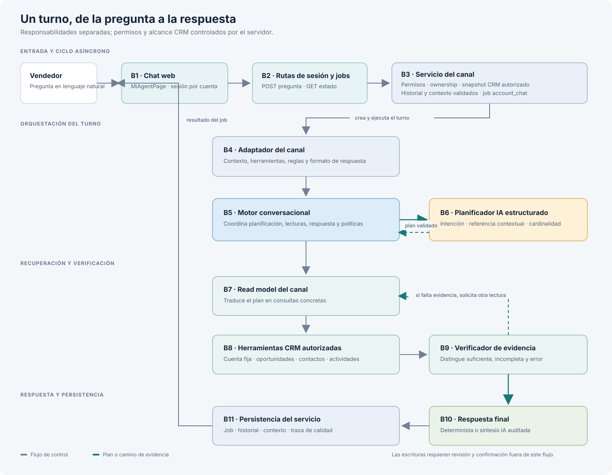

# Arquitectura del chat conversacional por canales

## Propósito

Este documento describe cómo se conectan la interfaz de chat, las sesiones y jobs de API, el motor conversacional compartido, los adaptadores de canal, el planificador, las herramientas CRM y la verificación de evidencia.

La arquitectura separa responsabilidades: la UI administra la interacción; el servicio controla acceso y persistencia; el motor coordina el turno; cada adaptador traduce el contexto de su canal; y las herramientas autorizadas recuperan datos. El modelo propone planes y respuestas, pero no concede permisos ni ejecuta escrituras CRM.

## Vista general



Un turno es asíncrono: la API responde con un job, el servicio lo procesa y la UI consulta su estado hasta recibir el resultado.

## Conceptos: sesión, job y snapshot

Estos objetos tienen ciclos de vida distintos; sus IDs no son intercambiables:

| Concepto | Qué representa | Persistencia y duración |
| --- | --- | --- |
| **Sesión** (`chatSessionId`) | La conversación del vendedor dentro de una cuenta y un contexto seleccionado. Agrupa varios turnos. | Fila de `customer_intelligence_chat_sessions`; conserva `history_json` y `context_json` para continuar la conversación. |
| **Job** (`jobId`) | El procesamiento asíncrono de una pregunta individual. Una sesión puede tener muchos jobs. | Fila de `customer_intelligence_jobs`; conserva la solicitud, el estado (`pending`, `running`, `completed` o `failed`), el resultado y el error cuando aplica. La UI consulta el job, no la sesión, mientras espera. |
| **Snapshot** | Una proyección autorizada y acotada de datos CRM que se usa para validar el contexto y atender las lecturas de un turno. Incluye solo los dominios disponibles para la cuenta, permisos y consultas aplicables. | Objeto de trabajo reconstruido desde CRM; no es el historial ni el contenedor de la sesión. Se normaliza y se mide para detectar errores/truncamiento; no se guarda como copia completa del CRM en `history_json` ni en `context_json`. |

Relación: `una sesión → muchos jobs`; cada job procesa su pregunta con un snapshot de trabajo. Al completarse, se guarda el resultado en el job y se actualizan el historial/contexto de la sesión. Por ejemplo, la sesión `15` contiene los turnos; los jobs `112`, `113`, `114` y `115` representan preguntas distintas de esa misma conversación. El snapshot no se identifica con ninguno de esos IDs.

Los ejemplos siguientes reemplazan los escenarios ficticios con la conversación más reciente del chat de Cliente existente: sesión `15`, cuenta Totalplay (`accountId: 22`), jobs `112`–`115`. Los códigos `B1`–`B11` corresponden a los bloques del gráfico. **Solo los payloads marcados HTTP cruzan la red; los demás JSON representan objetos internos entre funciones.** Los resultados voluminosos se muestran como conteos o fragmentos.

### Ejemplo 1: resumen de cuenta

> Vendedor: dame un resumen de la cuenta
>
> Chat: Resumen de Totalplay: 8 oportunidades abiertas con un pipeline de USD 4,510,000; 9 contactos activos visibles.

**Paso 1 · B1 → B2: crear o recuperar la sesión.** La sesión representa toda la conversación de esta cuenta. Solo se crea en el primer mensaje; la UI guarda el ID que recibe y lo reutiliza después.

En una conversación nueva, la UI envía este body HTTP:

`POST /api/commercial-intelligence/account-chat/sessions`

```json
{
	"accountId": 22,
	"objective": "Investigar cliente existente desde Mi Coach"
}
```

B2 devuelve el ID de sesión:

```json
{
	"session": {
		"id": 15,
		"accountId": 22,
		"opportunityId": null,
		"contactId": null
	}
}
```

En los siguientes mensajes de esta conversación, la UI **no vuelve a crear sesión**: reutiliza `chatSessionId: 15`.

**Paso 2 · B1 → B2: enviar la pregunta y crear un job.** Cada pregunta crea un job nuevo. Para este mensaje, la UI envía:

`POST /api/commercial-intelligence/account-chat/jobs`

```json
{
	"accountId": 22,
	"objective": "Investigar cliente existente desde Mi Coach",
	"chatSessionId": 15,
	"question": "dame un resumen de la cuenta",
	"includePublicResearch": false
}
```

B2 responde con un job pendiente. Aquí `chatSessionId` identifica la conversación completa y `job.id` identifica únicamente esta pregunta:

```json
{
	"job": {
		"id": 112,
		"chatSessionId": 15,
		"status": "pending",
		"pollAfterMs": 700
	}
}
```

Mientras se procesa, la UI consulta el job con su ID (`112`), no con el ID de sesión:

`GET /api/commercial-intelligence/account-chat/jobs/112`

La primera respuesta puede seguir pendiente:

```json
{
	"job": { "id": 112, "chatSessionId": 15, "status": "running" }
}
```

Cuando termina, la misma ruta devuelve el resultado:

```json
{
	"job": {
		"id": 112,
		"chatSessionId": 15,
		"status": "completed",
		"result": { "answer": "Resumen de Totalplay: 8 oportunidades abiertas con un pipeline de USD 4,510,000; 9 contactos activos visibles." }
	}
}
```

**Paso 3 · B2 → B3: despachar el job.** La UI no envía este objeto: es una llamada interna del servidor al worker.

```json
{
	"jobId": 112,
	"userId": 1
}
```

**Paso 4 · B3 → B4: preparar sesión y snapshot.** Después de autorizar al usuario y validar la sesión, B3 entrega al adaptador los campos relevantes:

```json
{
	"jobId": 112,
	"user": { "id": 1, "permissions": ["cuentas.read", "oportunidades.read", "contactos.read"] },
	"question": "Dame un resumen de la cuenta",
	"conversationHistory": [],
	"conversationContext": { "version": 1, "accountId": 22, "opportunityId": null, "intents": [], "filters": {} },
	"snapshot": {
		"account": { "id": 22, "name": "Totalplay" },
		"opportunities": { "resultCount": 14, "truncated": false },
		"contacts": { "resultCount": 9, "truncated": false },
		"interactions": { "resultCount": 2, "consultedByChatTools": false },
		"providerCatalogLoaded": false
	}
}
```

**Paso 5 · B4 → B5: iniciar turno del motor.** El adaptador invoca el motor con conversación, contexto y capacidades del canal:

```json
{
	"question": "Dame un resumen de la cuenta",
	"history": [],
	"context": {
		"accountId": 22,
		"opportunityId": null,
		"contactId": null,
		"conversationContext": { "accountId": 22, "opportunityId": null },
		"trustedEntityReferences": []
	},
	"jobId": 112,
	"availableTools": ["searchAccounts", "searchOpportunities", "searchContacts", "searchInteractions"]
}
```

**Paso 6 · B5 → B6 → B5: planificar.** El contexto que recibe el planificador contiene pregunta, historial resumido, selección y herramientas/catálogo permitidos:

```json
{
	"plannerContext": {
		"question": "Dame un resumen de la cuenta",
		"recentConversation": [],
		"selectedContext": { "accountSelected": true, "opportunitySelected": false, "contactSelected": false },
		"selectedAccountName": "Totalplay",
		"validatedContinuation": null,
		"trustedContinuationReferences": [],
		"permittedIntentCatalog": [{ "code": "account_overview", "label": "Resumen de cuenta" }],
		"permittedToolNames": ["searchAccounts", "searchOpportunities", "searchContacts"]
	}
}
```

El modelo devuelve este plan; B5 lo normaliza contra permisos y configuración:

```json
{
	"queries": ["account_overview"],
	"referenceResolution": { "targetType": "account", "cardinality": "single", "source": "account_scope", "candidateKeys": [] },
	"entities": { "accountReference": "", "opportunityReference": "", "contactReference": "", "leadReference": "" },
	"filters": { "opportunityStatus": "unspecified", "stageCode": "", "closeYear": 0, "periodMonths": 0, "startDate": "", "endDate": "" },
	"mode": "read_only",
	"confidence": "high"
}
```

El routing normalizado que pasa a B7 incluye:

```json
{
	"channel": "customer_account",
	"intent": "account_overview",
	"intents": ["account_overview"],
	"referenceResolution": { "targetType": "account", "cardinality": "single", "source": "account_scope", "candidateKeys": [] },
	"allowedTools": ["searchAccounts", "searchOpportunities", "searchContacts"],
	"filters": { "opportunityStatus": "unspecified" },
	"requiresClarification": false
}
```

**Paso 7 · B5 → B7 → B8: consultar dominios del plan.** B7 recibe pregunta, snapshot, routing, catálogo y herramientas ya filtradas. B8 recibe estas llamadas internas:

```json
[
	{ "toolName": "searchAccounts", "args": {} },
	{ "toolName": "searchOpportunities", "args": { "activeOnly": true, "openOnly": false } },
	{ "toolName": "searchContacts", "args": {} }
]
```

**Paso 8 · B8 → B9: pasar evidencia al verificador.** B9 recibe resultados de herramientas, no una afirmación resumida del modelo:

```json
{
	"question": "Dame un resumen de la cuenta",
	"intentPlan": { "intents": ["account_overview"], "filters": { "opportunityStatus": "unspecified" } },
	"evidence": [
		{ "toolName": "searchAccounts", "resultCount": 1, "queryFailed": false },
		{ "toolName": "searchOpportunities", "resultCount": 14, "queryFailed": false },
		{ "toolName": "searchContacts", "resultCount": 9, "queryFailed": false }
	],
	"round": 0,
	"hasQueryErrors": false
}
```

B9 devuelve cobertura suficiente:

```json
{ "status": "sufficient", "missingQueries": [], "missingFacts": [] }
```

**Paso 9 · B9 → B10: formar respuesta determinista.** B10 calcula desde las lecturas del job 112: 8 oportunidades abiertas con USD 4,510,000 y 9 contactos. No consulta IA para recalcular. Como no hubo llamada a `searchInteractions`, no redacta una sección de interacciones:

```json
{
	"answer": "Resumen de Totalplay: 8 oportunidades abiertas con un pipeline de USD 4,510,000; 9 contactos activos visibles.",
	"evidence": ["searchOpportunities: 8 oportunidades abiertas; pipeline USD 4,510,000.", "searchContacts: 9 contactos activos visibles."],
	"inferences": [],
	"confidence": "high",
	"operations": []
}
```

**Paso 10 · B10 → B3 → B11 → B2 → B1: persistir y mostrar.** B3 normaliza la respuesta; B11 guarda resultado, historial y contexto. El contexto no incluye oportunidad porque el resumen no eligió una:

```json
{
	"jobResult": { "answer": "Resumen de Totalplay: 8 oportunidades abiertas con un pipeline de USD 4,510,000; 9 contactos activos visibles.", "entities": { "accountId": 22, "opportunityId": null } },
	"sessionContext": { "version": 1, "accountId": 22, "opportunityId": null, "intents": ["account_overview"], "filters": { "opportunityStatus": "unspecified" } },
	"httpResponse": { "job": { "id": 112, "status": "completed", "result": "jobResult" } }
}
```

### Turnos 2–4: oportunidades y recomendación

**Turno 2: listar las ocho oportunidades abiertas (job 113)**

> Vendedor: cuales son las 8 oportunidades abiertas?
>
> Chat: La cuenta Totalplay tiene 8 oportunidades abiertas según el CRM autorizado. Estas son: 1) Solución (Dns) Periodo 2 2026, 2) Seguridad de las APIs, 3) Vrf 2027, 4) Hardware Refresh 3 Años, 5) Hardware Refresh, 6) Club WIFI Inicial, 7) Renovación Bluecat Red Empresarial Empresarial 2027, y 8) Club WIFI Bdds 75 Adicionales. Todas estas oportunidades están en proceso, con activación activada y lifecycle abierto.

Routing y lecturas resumidas de la traza real:

```json
{
"jobId": 113,
"sessionId": 15,
"question": "cuales son las 8 oportunidades abiertas?",
"routing": { "intent": "opportunity_query", "filters": { "opportunityStatus": "open" } },
"tools": [
{ "toolName": "searchAccounts", "resultCount": 1 },
{ "toolName": "searchOpportunities", "resultCount": 8 },
{ "toolName": "getSellerPipeline", "resultCount": 8 }
],
"evidence": { "status": "sufficient", "additionalReadQueries": 0 }
}
```

**Turno 3: encontrar la oportunidad de mayor valor (job 114)**

> Vendedor: indica cual es la oportunidad abierta de mas valor
>
> Chat: La oportunidad abierta de mayor valor en la cuenta Totalplay es “Vrf 2027” con un monto aproximado de 2,000,000 USD. Esta oportunidad está en la etapa “Contacto Inicial”, con activación activada y estado comercial en proceso.

**Paso 1 · B1 → B2: solicitar el turno.** El body HTTP incluye la sesión existente:

```json
{
	"accountId": 22,
	"objective": "Investigar cliente existente desde Mi Coach",
	"chatSessionId": 15,
	"question": "indica cual es la oportunidad abierta de mas valor",
	"includePublicResearch": false
}
```

La API responde y despacha el job:

```json
{
	"httpResponse": { "job": { "id": 114, "chatSessionId": 15, "status": "pending", "pollAfterMs": 700 } },
	"workerInput": { "jobId": 114, "userId": 1 }
}
```

**Paso 2 · B2 → B3 → B4: cargar sesión y snapshot.** El servicio valida cuenta/permisos y entrega al adaptador los campos relevantes:

```json
{
	"jobId": 114,
	"question": "indica cual es la oportunidad abierta de mas valor",
	"conversationHistory": [
		{ "role": "user", "text": "dame un resumen de la cuenta" },
		{ "role": "assistant", "text": "Resumen de Totalplay: 8 oportunidades abiertas con un pipeline de USD 4,510,000; 9 contactos activos visibles." },
		{ "role": "user", "text": "cuales son las 8 oportunidades abiertas?" },
		{ "role": "assistant", "text": "La cuenta Totalplay tiene 8 oportunidades abiertas según el CRM autorizado. Estas son: Solución (Dns) Periodo 2 2026, Seguridad de las APIs, Vrf 2027, Hardware Refresh 3 Años, Hardware Refresh, Club WIFI Inicial, Renovación Bluecat Red Empresarial Empresarial 2027 y Club WIFI Bdds 75 Adicionales. Todas están en proceso, activadas y con lifecycle abierto." }
	],
	"conversationContext": { "accountId": 22, "opportunityId": null, "intents": ["opportunity_query"], "filters": { "opportunityStatus": "open" } },
	"snapshot": { "account": { "id": 22, "name": "Totalplay" }, "opportunities": ["filas autorizadas"] }
}
```

**Paso 3 · B4 → B5 → B6 → B5: planificar.** El motor pasa pregunta/contexto al planificador; la salida se normaliza:

```json
{
	"plannerInput": { "question": "indica cual es la oportunidad abierta de mas valor", "selectedAccountName": "Totalplay", "validatedContinuation": null, "authorizedEntityCandidates": [{ "candidateKey": "opportunity_1", "name": "Vrf 2027" }] },
	"plan": { "queries": ["opportunity_query"], "referenceResolution": { "targetType": "opportunity", "cardinality": "single", "source": "current_message", "candidateKeys": ["opportunity_1"] }, "entities": { "opportunityReference": "Vrf 2027" }, "filters": { "opportunityStatus": "open" }, "mode": "read_only", "confidence": "high" },
	"routing": { "intent": "opportunity_query", "referenceResolution": { "targetType": "opportunity", "cardinality": "single", "source": "current_message", "candidateKeys": ["opportunity_1"] }, "allowedTools": ["searchAccounts", "searchOpportunities", "getSellerPipeline"], "filters": { "opportunityStatus": "open" } }
}
```

**Paso 4 · B5 → B7 → B8 → B9: recuperar y verificar.** B7 pide oportunidades abiertas y B8 devuelve filas CRM:

```json
{
	"tools": [
		{ "toolName": "searchAccounts", "resultCount": 1 },
		{ "toolName": "searchOpportunities", "resultCount": 8 },
		{ "toolName": "getSellerPipeline", "resultCount": 8 }
	],
	"assessment": { "status": "sufficient", "missingQueries": [], "missingFacts": [] }
}
```

**Paso 5 · B9 → B10 → B3 → B11: responder y guardar selección.** La respuesta incluye la oportunidad seleccionada como ID estructurado; el servicio lo valida antes de persistir:

```json
{
	"response": { "answer": "La oportunidad abierta de mayor valor en la cuenta Totalplay es Vrf 2027, por 2,000,000 USD. Está en Contacto Inicial, activada y en proceso.", "entities": { "opportunityId": 94 }, "evidence": ["Vrf 2027: 2,000,000 USD, Contacto Inicial, activa, en proceso"] },
	"sessionContext": { "accountId": 22, "opportunityId": 94, "intents": ["opportunity_query"], "filters": { "opportunityStatus": "open" } }
}
```

**Turno 4: pedir recomendación para esa oportunidad (job 115)**

> Vendedor: que me sugieres hacer en esta oportunidad?
>
> Chat: La oportunidad 'Vrf 2027' en la cuenta Totalplay, valorada en 2,000,000 USD y actualmente en la etapa 'Contacto Inicial', presenta un estado de preparación incompleto. Según el CRM, aún falta responder la pregunta crítica para esta etapa: ¿Qué necesidad, iniciativa, problema o interés concreto expresa el cliente que justifique abrir esta oportunidad? Además, no hay acuerdos confirmados ni un siguiente paso concretado. Se recomienda priorizar resolver esta pregunta con el cliente para justificar y avanzar la oportunidad. También es importante planear un siguiente paso de seguimiento, como una reunión, demo o actividad concreta, para confirmar el interés y mantener el avance. Esta recomendación busca asegurar que la etapa 'Contacto Inicial' se cumpla adecuadamente para evitar riesgos y activar el compromiso del cliente. La oportunidad presenta señales de riesgo por falta de actualización comercial en 59 días, lo que implica la urgencia de reactivar la interacción y clarificar las necesidades del cliente para avanzar efectivamente.

**Paso 1 · B1 → B2: enviar seguimiento.** El mismo `chatSessionId` conserva la conversación; la pregunta no necesita incluir ID ni nombre:

```json
{
	"accountId": 22,
	"objective": "Investigar cliente existente desde Mi Coach",
	"chatSessionId": 15,
	"question": "que me sugieres hacer en esta oportunidad?",
	"includePublicResearch": false
}
```

**Paso 2 · B2 → B3 → B4 → B5: rehidratar contexto.** El servicio valida que el ID 94 siga perteneciendo a la cuenta y al snapshot:

```json
{
	"workerInput": { "jobId": 115, "userId": 1 },
	"conversationHistory": [
		{ "role": "user", "text": "dame un resumen de la cuenta" },
		{ "role": "assistant", "text": "Resumen de Totalplay: 8 oportunidades abiertas con un pipeline de USD 4,510,000; 9 contactos activos visibles." },
		{ "role": "user", "text": "cuales son las 8 oportunidades abiertas?" },
		{ "role": "assistant", "text": "La cuenta Totalplay tiene 8 oportunidades abiertas según el CRM autorizado. Estas son: Solución (Dns) Periodo 2 2026, Seguridad de las APIs, Vrf 2027, Hardware Refresh 3 Años, Hardware Refresh, Club WIFI Inicial, Renovación Bluecat Red Empresarial Empresarial 2027 y Club WIFI Bdds 75 Adicionales. Todas están en proceso, activadas y con lifecycle abierto." },
		{ "role": "user", "text": "indica cual es la oportunidad abierta de mas valor" },
		{ "role": "assistant", "text": "La oportunidad abierta de mayor valor en la cuenta Totalplay es Vrf 2027 con un monto aproximado de 2,000,000 USD. Está en Contacto Inicial, activada y en proceso." }
	],
	"conversationContext": { "accountId": 22, "opportunityId": 94, "intents": ["opportunity_query"], "filters": { "opportunityStatus": "open" } },
	"trustedEntityReferences": ["Vrf 2027"]
}
```

**Paso 3 · B5 → B6 → B5: planificar con referencia.** El planificador recibe la pregunta y la referencia autorizada; devuelve una consulta de detalle/seguimiento y filtros:

```json
{
	"question": "que me sugieres hacer en esta oportunidad?",
	"validatedContinuation": { "opportunityName": "Vrf 2027", "intents": ["opportunity_query"], "filters": { "opportunityStatus": "open" } },
	"trustedContinuationReferences": ["Vrf 2027"],
	"authorizedEntityCandidates": [{ "candidateKey": "opportunity_1", "name": "Vrf 2027", "stageName": "Contacto Inicial" }],
	"plan": { "queries": ["opportunity_guidance"], "referenceResolution": { "targetType": "opportunity", "cardinality": "single", "source": "conversation_history", "candidateKeys": ["opportunity_1"] }, "entities": { "opportunityReference": "Vrf 2027" }, "filters": { "opportunityStatus": "open" }, "mode": "read_only", "confidence": "high" },
	"routing": { "allowedTools": ["getOpportunity", "getOpportunityActivities", "getOpportunityReadiness", "searchInteractions"], "serverResolvedEntityIds": { "opportunityId": 94 } }
}
```

El modelo ve el alias `opportunity_1`, no el ID `94`. `serverResolvedEntityIds` es interno entre B5 y B7; no se incluye en el prompt ni se devuelve al cliente HTTP. El planificador interpreta la referencia con historial/contexto y el servidor valida el alias contra la cuenta antes de ejecutar lecturas.

**Paso 4 · B5 → B7 → B8: leer el registro seleccionado.** El read model usa el ID validado:

```json
[
	{ "toolName": "searchInteractions", "resultCount": 2 },
	{ "toolName": "getOpportunity", "resultCount": 1 },
	{ "toolName": "getOpportunityActivities", "resultCount": 0 },
	{ "toolName": "getOpportunityReadiness", "resultCount": 1 }
]
```

**Paso 5 · B8 → B9: verificar resultados.** B9 recibe los resultados y decide si cubren la pregunta:

```json
{
	"readToolResults": [{ "toolName": "searchInteractions", "resultCount": 2 }, { "toolName": "getOpportunity", "resultCount": 1 }, { "toolName": "getOpportunityActivities", "resultCount": 0 }, { "toolName": "getOpportunityReadiness", "resultCount": 1 }],
	"assessment": { "status": "sufficient", "missingQueries": [], "missingFacts": [] }
}
```

**Paso 6 · B9 → B10: sintetizar y auditar.** Esta recomendación usa síntesis IA; el auditor contrasta la respuesta propuesta con las lecturas autorizadas:

```json
{
	"answer": "La oportunidad 'Vrf 2027' en la cuenta Totalplay, valorada en 2,000,000 USD y actualmente en la etapa 'Contacto Inicial', presenta un estado de preparación incompleto. Según el CRM, aún falta responder la pregunta crítica para esta etapa: ¿Qué necesidad, iniciativa, problema o interés concreto expresa el cliente que justifique abrir esta oportunidad? Además, no hay acuerdos confirmados ni un siguiente paso concretado. Se recomienda priorizar resolver esta pregunta con el cliente para justificar y avanzar la oportunidad. También es importante planear un siguiente paso de seguimiento, como una reunión, demo o actividad concreta, para confirmar el interés y mantener el avance. Esta recomendación busca asegurar que la etapa 'Contacto Inicial' se cumpla adecuadamente para evitar riesgos y activar el compromiso del cliente. La oportunidad presenta señales de riesgo por falta de actualización comercial en 59 días, lo que implica la urgencia de reactivar la interacción y clarificar las necesidades del cliente para avanzar efectivamente.",
	"pendingItems": ["Confirmar con el cliente la necesidad concreta que justifica la oportunidad.", "Definir y acordar un siguiente paso concreto de seguimiento para mantener la oportunidad activa."],
	"confidence": "high"
}
```

**Paso 7 · B10 → B3 → B11 → B2 → B1: persistir y mostrar.** Job completado, resultado y contexto actualizado:

```json
{
	"job": { "id": 115, "status": "completed", "result": { "entities": { "accountId": 22, "opportunityId": 94 }, "confidence": "high", "pendingItems": ["necesidad concreta", "siguiente paso"] } },
	"sessionContext": { "accountId": 22, "opportunityId": 94, "intents": ["opportunity_guidance"] }
}
```

Los JSON reproducen los campos relevantes de la sesión 15. Las filas completas del snapshot se resumen mediante conteos y métricas para no copiar todos los datos CRM; los textos de respuesta corresponden a los resultados guardados en los jobs 112–115. La continuidad no amplía el alcance a otra cuenta ni ejecuta cambios.

Los datos sensibles del CRM no se generalizan a otras cuentas; esta transcripción corresponde a Totalplay y se incluye para explicar el flujo técnico solicitado.

## Componentes

### 1. Interfaz del chat

Archivo principal: `apps/web/src/MiAgentPage.jsx`.

La interfaz:

- Presenta mensajes, fuentes, confianza, evidencia, acciones y operaciones propuestas.
- Mantiene el ID de sesión de Cliente existente en `sessionStorage`, separado por cuenta.
- Crea o recupera la sesión, envía cada pregunta como job y consulta el job hasta que termina.
- Muestra el resultado; no decide qué datos CRM puede leer el usuario ni ejecuta consultas por sí misma.

La UI es el cliente de la conversación, no el orquestador de herramientas.

### 2. Rutas HTTP

Para Cliente existente, las rutas están en `apps/api/src/routes.commercial-intelligence.js`:

- `POST /api/commercial-intelligence/account-chat/sessions`: crea una sesión asociada al contexto CRM seleccionado.
- `GET /api/commercial-intelligence/account-chat/sessions/:sessionId`: recupera sesión e historial del usuario autorizado.
- `POST /api/commercial-intelligence/account-chat/jobs`: crea un job `account_chat` y programa su procesamiento.
- `GET /api/commercial-intelligence/account-chat/jobs/:jobId`: permite consultar estado y resultado del job.

Las rutas aplican permisos de acceso antes de invocar al servicio. El identificador de sesión no reemplaza la validación de usuario, cuenta, permisos u ownership.

### 3. Servicio y persistencia del canal

Implementación principal: `apps/api/src/commercial-intelligence/service.js`.

El servicio es responsable del ciclo de vida del job:

1. Carga el job y comprueba que pertenece al usuario y al tipo `account_chat`.
2. Recupera la sesión y su historial/contexto persistidos.
3. Comprueba que la sesión conserva la misma cuenta y entidades CRM seleccionadas.
4. Construye el snapshot CRM mediante consultas con permisos y restricciones de ownership.
5. Valida el contexto conversacional contra la cuenta y los registros presentes en ese snapshot.
6. Prepara el adaptador y ejecuta el turno del motor.
7. Valida las entidades de la respuesta, registra una traza y guarda el historial/contexto actualizado junto con el resultado del job.

El servicio, no el modelo, es la autoridad sobre el alcance de datos. En Cliente existente el alcance se fija a una cuenta autorizada; una mención textual a otra cuenta no amplía ese alcance.

### 4. Sesión, historial y contexto conversacional

El historial visible y el contexto estructurado se conservan por separado en `customer_intelligence_chat_sessions`:

- `history_json` contiene turnos recientes usados para mantener la conversación natural.
- `context_json` contiene entidades y filtros validados, como cuenta, oportunidad, contacto, lead, intención y periodo.

El contexto no se acepta directamente porque el modelo o el cliente lo propongan. `validateCustomerConversationContext` comprueba que la cuenta coincide y que cada ID sigue perteneciendo al snapshot autorizado. Referencias inválidas se descartan. El servicio entrega el contexto validado al planificador en cada turno; no usa una heurística de frases para decidir si la pregunta continúa una entidad anterior.

Código: `apps/api/src/commercial-intelligence/conversation-context.js` y `apps/api/src/commercial-intelligence/service.js`.

### 5. Adaptadores de canal

El motor es compartido; el adaptador contiene las particularidades del canal: contexto, herramientas, planificación, reglas y normalización de respuestas.

| Canal | Adaptador | Contexto y persistencia |
| --- | --- | --- |
| Coach | `apps/api/src/coach/coach-adapter.js` | CRM autorizado; sesiones e historial de Coach. |
| Cliente existente | `apps/api/src/commercial-intelligence/customer-chat-adapter.js` | Una cuenta CRM fija; jobs y sesiones `account_chat`. |
| Cuenta nueva | `apps/api/src/prospect-research/prospect-chat-adapter.js` | Sesión de prospecto, hallazgos y evidencia pública; sin crear entidades CRM hasta una conversión confirmada. |

Los adaptadores comparten el motor, no el historial ni la autorización del otro canal.

### 6. Motor conversacional común

Implementación: `apps/api/src/coach/conversation-engine.js`.

`runConversationEngine` coordina el turno sin administrar rutas HTTP ni persistir sesiones. Recibe una pregunta, historial, contexto, permisos, reglas, herramientas y callbacks del adaptador. Según el canal, ejecuta el flujo de planificación, prepara el read model, construye el contexto de respuesta, aplica el contrato de operaciones y normaliza la respuesta.

Sus dependencias son deliberadamente inyectadas. El motor invoca `planChannelIntent`, `prepareReadModel`, `executeReadTool`, `requestResponse` y `normalizeResponse` sin necesitar saber cómo cada canal obtiene su snapshot o persiste su conversación.

### 7. Planificador de consultas

Cliente existente usa un planificador estructurado implementado por el adaptador con `runStructuredTextResearch` y el esquema `customer_account_query_plan`. La intención `account_overview` requiere lecturas de cuenta, oportunidades y contactos autorizados; no implica una lectura de interacciones. `opportunity_guidance` es exclusiva de Cliente existente, exige contexto de cuenta y oportunidad y permite consultar `getOpportunity`, `getOpportunityActivities`, `getOpportunityReadiness` y `searchInteractions`. La pantalla **Enrutamiento por canal** puede ajustar sus ejemplos, prioridad y subconjunto permitido de herramientas; el código mantiene la lista máxima permitida y sus patrones de clasificación.

El plan propone:

- Una o varias intenciones/códigos de consulta.
- `referenceResolution`: tipo de objetivo, cardinalidad, origen de referencia y aliases candidatos.
- Referencias literales de entidades y filtros.
- Si la pregunta requiere aclaración.
- El modo de consulta.

El contexto del planificador incluye pregunta, historial resumido, contexto validado y candidatos CRM de la cuenta. Cada candidato se presenta con una clave efímera como `opportunity_1`, nombre y atributos necesarios; los IDs CRM y el mapa alias → ID permanecen en el servidor. Así la IA puede decidir que “esa oportunidad” retoma una entidad anterior aunque el mensaje actual no repita su nombre.

El servidor normaliza el plan contra el catálogo vigente del canal, valida el alias elegido y su pertenencia a la cuenta activa, y lo intersecta con herramientas permitidas por permisos y reglas. Solo entonces mapea el alias a un ID interno para las lecturas. Una consulta de cartera puede indicar cardinalidad `all`; una operación requiere un único destino y se aclara si el plan es ambiguo, incompleto o inválido. El modelo no envía llamadas ejecutables ni IDs que amplíen el alcance. El catálogo y la normalización están en `apps/api/src/coach/channel-intents.js` y `apps/api/src/coach/channel-intent-governance.js`.

El contrato usa `referenceResolution.targetType`, `cardinality`, `source` y `candidateKeys`. No hay un detector léxico que decida si se retoma una entidad; la interpretación del planificador gobierna esa selección. La interpretación de fechas explícitas sigue siendo determinista y no selecciona entidades.

El planificador decide **qué evidencia pedir**; no consulta el CRM por sí mismo.

### 8. Read model y herramientas

El read model traduce el plan/contexto a lecturas concretas. Para Cliente existente se construye en `buildCustomerReadModel` dentro de `customer-chat-adapter.js`; las herramientas comunes se implementan en `apps/api/src/coach/crm-read-tools.js`.

Entre otras, las herramientas permiten buscar cuentas y oportunidades, recuperar una oportunidad, consultar contactos, actividades, pipeline y cotizaciones. Cliente existente agrega `searchInteractions`. Cada herramienta recibe un snapshot ya autorizado; además aplica filtros de canal y valida relaciones con la cuenta fija.

El modelo recibe resultados de lectura, no credenciales SQL. Las herramientas son de solo lectura durante esta fase del turno.

### 9. Verificación de evidencia

`apps/api/src/commercial-intelligence/customer-chat-evidence.js` administra el ciclo de evidencia de Cliente existente:

1. Un verificador evalúa si los resultados cubren todas las partes de la pregunta.
2. Si falta un dominio consultable, propone consultas adicionales.
3. El servidor valida esas consultas nuevamente contra catálogo, permisos y herramientas ya usadas.
4. El verificador vuelve a evaluar el conjunto completo.

Los límites actuales son dos rondas adicionales, ocho lecturas como máximo y 45 segundos para el turno. Se distingue evidencia suficiente, cero resultados válidos, consultas fallidas, evidencia incompleta y timeout. Una consulta fallida no se presenta como ausencia de registros.

### 10. Síntesis y auditoría de respuesta

Solo si el verificador acepta la evidencia como suficiente, el adaptador llama al modelo con el esquema `account_contextual_chat`. La respuesta incluye texto, evidencia, inferencias, confianza, elementos pendientes y entidades estructuradas cuando corresponda.

La intención simple `account_overview` usa una respuesta determinista desde los resultados exitosos del read model: cuenta, oportunidades abiertas y pipeline calculados desde las filas devueltas, y contactos si su consulta se ejecutó. No solicita al modelo recalcular esas cifras. Las interacciones solo se mencionan si `searchInteractions` produjo resultados en el turno; si no se consultó esa fuente, se omite esa sección. El catálogo global `provider_catalog` no se carga para resúmenes; solo se incluye en snapshots conversacionales cuando la pregunta solicita explícitamente expansión, upsell, venta cruzada o productos complementarios. Los demás consumidores del snapshot mantienen su comportamiento por defecto.

Las respuestas sintetizadas con IA pasan después por una auditoría separada que contrasta sus afirmaciones factuales con los resultados autorizados. Una respuesta no respaldada o una auditoría inconclusa cierra en seguro y elimina operaciones propuestas no verificadas.

Finalmente, el normalizador y el servicio validan las entidades contra la cuenta y las herramientas ejecutadas antes de persistir contexto para el siguiente turno.

### 11. Operaciones propuestas

El modelo puede proponer una operación, pero no escribir directamente en el CRM. Los contratos de `apps/api/src/coach/operation-contract.js` y `apps/api/src/coach/contract.js` normalizan y filtran operaciones por canal y permisos. La revisión, confirmación, ejecución y auditoría pertenecen a los flujos controlados existentes.

Cuando el vendedor pulsa **Preparar actividad** en Cliente existente, la propuesta llega al diálogo compartido de confirmación con `accountId` y `opportunityId` validados. Ese origen entrega al diálogo una lista de opciones limitada a la oportunidad recomendada dentro de la cuenta seleccionada; el desplegable la muestra preseleccionada. Las aperturas normales desde Coach no pasan ese override y conservan la lista de oportunidades que ya tenían.

### 12. Trazas y diagnóstico

`apps/api/src/coach/observability.js` registra trazas por canal, sesión y job. Incluyen intención, entidades resueltas, herramientas, conteos, estado de evidencia, errores, latencia y operaciones propuestas. No deben usarse como reemplazo de logs de argumentos técnicos; su diseño minimiza el almacenamiento de datos sensibles.

## Contrato entre motor y adaptador

La separación depende de que el motor pase al adaptador tanto las herramientas permitidas como la semántica del plan: intención, referencias, filtros y catálogo. Las herramientas permitidas responden **qué se puede ejecutar**; la semántica responde **qué debe consultar este turno**.

### Contrato implementado y prueba de routing

El motor entrega `channelIntentRouting` y `channelIntentCatalog` al callback `prepareReadModel` en `conversation-engine.js`. El adaptador de Cliente existente reenvía ambos campos a `buildCustomerReadModel`, junto con las herramientas filtradas por permisos. El read model puede aplicar las intenciones, referencias y filtros del plan en vez de depender exclusivamente de condiciones por palabras clave.

La prueba `forwards structured routing to read tools when question wording has no keyword trigger` en `apps/api/test/customer-chat-adapter.test.js` verifica que una intención estructurada activa `searchInteractions` incluso cuando la pregunta no contiene disparadores léxicos. El routing no concede permisos ni amplía el alcance: el servidor sigue intersectándolo con catálogo, herramientas autorizadas, reglas del canal y snapshot de la cuenta.

## Límites de seguridad

- La cuenta seleccionada determina el alcance; texto del modelo o del vendedor no lo amplía.
- Permisos, ownership y pertenencia de entidades se validan en servidor.
- El planificador sugiere; el servidor autoriza y ejecuta lecturas.
- CRM, fuentes públicas e inferencias permanecen diferenciados.
- No se afirma ausencia de datos por un error o una lectura incompleta.
- Las escrituras siempre requieren el flujo de confirmación autorizado.

## Referencias de código

- Interfaz y ciclo de polling: `apps/web/src/MiAgentPage.jsx`.
- Rutas Cliente existente: `apps/api/src/routes.commercial-intelligence.js`.
- Servicio, snapshot, jobs y persistencia: `apps/api/src/commercial-intelligence/service.js`.
- Motor común: `apps/api/src/coach/conversation-engine.js`.
- Adaptador Cliente existente: `apps/api/src/commercial-intelligence/customer-chat-adapter.js`.
- Contrato de continuidad: `apps/api/src/commercial-intelligence/conversation-context.js`.
- Planes por canal: `apps/api/src/coach/channel-intents.js`.
- Loop de evidencia: `apps/api/src/commercial-intelligence/customer-chat-evidence.js`.
- Herramientas CRM: `apps/api/src/coach/crm-read-tools.js`.
- Trazas: `apps/api/src/coach/observability.js`.
- Contrato funcional Cliente existente: [chat-cliente-existente-alcance.md](./chat-cliente-existente-alcance.md).
- Integración de los tres canales: [integraciones-mi-coach.md](./integraciones-mi-coach.md).