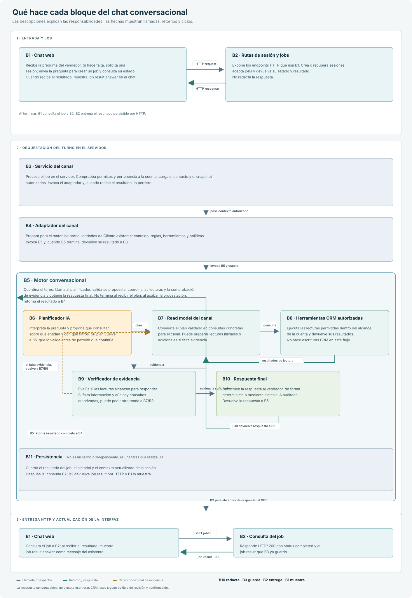

# Arquitectura del chat conversacional por canales

## Propósito

Este documento explica cómo una pregunta viaja desde la interfaz hasta los datos CRM y cómo regresa como respuesta. La arquitectura separa la experiencia del chat, la autorización, la planificación de consultas, la lectura de datos y la persistencia.

La regla principal es que el modelo puede interpretar una pregunta y proponer qué información consultar, pero no decide permisos ni accede directamente a la base de datos. El servidor valida el alcance, ejecuta las lecturas autorizadas y controla cualquier operación que pueda modificar el CRM.

## Vista general

Cada pregunta inicia un turno asíncrono: la API crea un job, el servidor lo procesa y la interfaz consulta su estado hasta recibir el resultado.

## Conceptos principales

| Concepto | Responsabilidad | Ciclo de vida |
| --- | --- | --- |
| **Sesión** (`chatSessionId`) | Agrupa la conversación y conserva su historial y contexto validado. | Persiste entre varios turnos. En Cliente existente queda asociada a una cuenta y a las entidades seleccionadas. |
| **Job** (`jobId`) | Representa el procesamiento de una pregunta individual. | Tiene un estado y un resultado propios. La interfaz consulta el job mientras se procesa. |
| **Snapshot** | Proyección temporal de datos CRM que el usuario puede consultar en ese turno. | Se reconstruye desde el CRM, con permisos y límites aplicados. No es el historial de la conversación ni una copia completa del CRM. |
| **Contexto conversacional** | Conserva las entidades, intenciones y filtros autorizados que dan continuidad a la conversación. | Se valida contra la cuenta y el snapshot antes de usarse en cada turno. |

Una sesión puede contener varios jobs. El snapshot se prepara para procesar un job; al finalizar, el resultado y el contexto actualizado se guardan en sus registros correspondientes.

## Recorrido de un turno

Los códigos B1–B11 corresponden al gráfico. La tabla resume la responsabilidad de cada bloque; no representa once servicios independientes.

| Bloque | Responsabilidad |
| --- | --- |
| **B1 · Interfaz** | Muestra la conversación, envía la pregunta y el contexto seleccionado, conserva el ID de sesión y consulta el job. En Cliente existente envía el `accountId` de la cuenta seleccionada; no se obtiene interpretando el texto de la pregunta. |
| **B2 · Rutas y jobs** | Autentica y valida la solicitud, crea o recupera la sesión, crea el job y devuelve su estado y resultado a la interfaz. |
| **B3 · Servicio del canal** | Comprueba que el job y la sesión pertenezcan al usuario, valida la cuenta y sus entidades, reconstruye el snapshot autorizado y coordina el procesamiento y la persistencia del canal. |
| **B4 · Adaptador** | Traduce el contexto y las reglas del canal al contrato que espera el motor compartido. También normaliza la respuesta para ese canal. |
| **B5 · Motor conversacional** | Coordina el turno: planificación, lecturas, verificación de evidencia y preparación de la respuesta. No administra sesiones HTTP ni autoriza datos CRM. |
| **B6 · Planificador** | Interpreta la intención, las referencias a entidades, los filtros y si hace falta una aclaración. Su plan es una propuesta, no una autorización. |
| **B7 · Read model** | Convierte el plan validado en lecturas disponibles para el canal y limita las herramientas a las permitidas. |
| **B8 · Herramientas de lectura** | Ejecuta consultas CRM de solo lectura sobre el snapshot autorizado y devuelve resultados acotados. |
| **B9 · Verificador de evidencia** | Comprueba si las lecturas responden la pregunta. Si falta información, puede solicitar lecturas adicionales sujetas a los mismos controles y límites. |
| **B10 · Respuesta** | Forma una respuesta a partir de evidencia verificada. Algunas respuestas se calculan de forma determinista; otras pasan por síntesis y auditoría. |
| **B11 · Persistencia** | Guarda el resultado del job, el historial y el contexto actualizado de la sesión, además de las trazas permitidas. |

La interfaz muestra la respuesta que recibe de la API. No ejecuta consultas CRM ni compone por su cuenta la respuesta del motor.

## Cómo se determina la cuenta

En Cliente existente, la interfaz envía el `accountId` seleccionado junto con la solicitud. La API lo trata como una entrada que debe validar, no como una autorización.

B3 comprueba el acceso del usuario a esa cuenta y usa el `account_id` guardado en el job para reconstruir el snapshot. También comprueba que la cuenta del snapshot coincida con la del job y valida que oportunidades y contactos pertenezcan al mismo contexto. Si la sesión no coincide o el usuario no tiene acceso, el turno se rechaza.

El diagnóstico permite seguir esta validación: B1 muestra el `accountId` enviado; B3 registra la cuenta solicitada y la cuenta autorizada en el snapshot, y comprueba que coincidan. Una mención a otra empresa dentro del texto no cambia la cuenta activa.

## Agentes de inteligencia comercial

B3 prepara resultados de ocho roles de inteligencia comercial:

- **`crm_context`**: contexto e información relevante obtenida del CRM.
- **`commercial_health`**: señales de salud y riesgos comerciales.
- **`public_research`**: investigación pública sobre la cuenta.
- **`contact_research`**: búsqueda pública de contactos relevantes.
- **`technology_research`**: señales públicas sobre tecnología e iniciativas.
- **`expansion`**: hipótesis de renovación o expansión.
- **`synthesis`**: integración de hallazgos.
- **`actions`**: posibles siguientes pasos sujetos a revisión humana.

Los roles de investigación pública se ejecutan solo cuando la solicitud y la gobernanza lo permiten. Los demás resultados se construyen con el snapshot y las reglas del servicio; por eso, que exista un rol no significa que siempre consulte un proveedor externo o un modelo.

`agentMetrics` es telemetría de esos resultados, no un indicador de desempeño comercial. Por agente registra:

- `agentId`: identificador del rol.
- `status`: estado del resultado.
- `evidenceCount`: cantidad de elementos de evidencia reportados.
- `errorCode`: código de error cuando el agente falla; en caso contrario, `null`.

El resumen visible de B3 muestra cuántos agentes preparó. El detalle por agente se conserva en el diagnóstico JSON del turno.

## Motor compartido y adaptadores

El motor conversacional común coordina el procesamiento, pero cada canal conserva su propia autorización, contexto, herramientas y persistencia. Compartir el motor no comparte automáticamente sesiones ni amplía permisos entre canales.

| Canal | Adaptador | Alcance |
| --- | --- | --- |
| **Coach** | `apps/api/src/coach/coach-adapter.js` | Contexto CRM autorizado y sesiones de Coach. |
| **Cliente existente** | `apps/api/src/commercial-intelligence/customer-chat-adapter.js` | Cuenta CRM seleccionada, sesiones `account_chat` y datos autorizados de esa cuenta. |
| **Cuenta nueva** | `apps/api/src/prospect-research/prospect-chat-adapter.js` | Investigación y evidencia de prospectos; la conversión a CRM requiere confirmación. |

El adaptador aporta al motor las instrucciones del canal, el contexto validado, las herramientas permitidas y las funciones necesarias para consultar y normalizar resultados.

## Planificación y lecturas

El planificador determina qué intención y entidades parecen corresponder a la pregunta, qué filtros aplicar y qué lecturas podrían aportar evidencia. No consulta el CRM ni concede permisos.

El servidor normaliza el plan contra el catálogo del canal y las reglas vigentes. Las referencias a registros se resuelven como aliases temporales; los IDs CRM y su relación con esos aliases permanecen en el servidor. Antes de ejecutar una lectura, el servidor valida que la entidad pertenezca a la cuenta activa y que la herramienta esté permitida.

El read model traduce el plan validado a herramientas concretas. Estas reciben resultados acotados del snapshot autorizado, no credenciales SQL. Las lecturas son de solo lectura; el catálogo de proveedores solo se incorpora cuando la solicitud lo necesita y la política lo permite.

## Evidencia y respuesta

El verificador comprueba si las fuentes consultadas cubren la pregunta. Puede pedir lecturas adicionales, pero el servidor vuelve a validarlas contra el catálogo, los permisos y los límites del turno. Una consulta con error o incompleta no se presenta como prueba de que no existan registros.

Cuando la evidencia es suficiente, la respuesta se construye desde esos resultados. Las respuestas estructuradas pueden calcularse de forma determinista; las que requieren síntesis usan un contrato de respuesta y pasan por una auditoría que contrasta sus afirmaciones con la evidencia autorizada. Si no se puede verificar una afirmación, la respuesta se limita en lugar de ampliar lo que se sabe.

## Operaciones y escrituras

El modelo puede proponer una operación, pero no escribe directamente en el CRM. El servidor valida la entidad y la propuesta contra el canal, los permisos y el contexto autorizado. La revisión, confirmación, ejecución y auditoría pertenecen a los flujos de operación existentes.

Si el destino es ambiguo o no puede validarse, el sistema solicita aclaración o no ofrece la operación. Las propuestas que requieren cambios no se ejecutan sin la confirmación correspondiente.

## Diagnóstico y observabilidad

Las trazas relacionan canal, sesión y job, y registran información operativa como intención, entidades validadas, herramientas consultadas, conteos, estado de evidencia, errores y latencia. El diagnóstico B1–B11 ayuda a identificar en qué responsabilidad ocurrió un problema.

En entornos distintos de producción, el seguimiento detallado reúne dos carriles: los intercambios HTTP observados por B1 y los spans del worker. Cada span registra llamada y retorno, tiempos, resultado resumido y relación con su llamada padre; por eso las llamadas internas se muestran anidadas y los retornos invierten la dirección. El bucle B9 → B7 aparece solo cuando se solicitan y ejecutan lecturas adicionales. Los spans se registran durante la ejecución, no se infieren de `flowEdges`; los datos CRM se limitan a resúmenes saneados.

El diagnóstico de cuenta permite comparar el ID enviado por B1 con la cuenta autorizada por B3. `agentMetrics` resume estado y evidencia de los roles de inteligencia comercial. Estas métricas describen la ejecución; no reemplazan las métricas de ventas ni deben incluir filas completas del CRM o datos sensibles innecesarios.

## Límites de seguridad

- La selección de cuenta establece el alcance inicial, pero el servidor siempre verifica acceso y ownership.
- El texto del usuario y la salida del modelo no pueden cambiar la cuenta autorizada.
- El planificador sugiere lecturas; el servidor decide cuáles están permitidas y las ejecuta.
- Los datos CRM, la investigación pública y las inferencias se mantienen identificables como fuentes distintas.
- Un error, timeout, truncamiento o lectura omitida no se interpreta como ausencia confirmada de información.
- Las escrituras pasan por los flujos autorizados de revisión y confirmación.

## Referencias de código

- Interfaz y ciclo de consulta del job: `apps/web/src/MiAgentPage.jsx`.
- Rutas de Cliente existente: `apps/api/src/routes.commercial-intelligence.js`.
- Servicio, autorización, snapshot, agentes y persistencia: `apps/api/src/commercial-intelligence/service.js`.
- Motor conversacional compartido: `apps/api/src/coach/conversation-engine.js`.
- Adaptador de Cliente existente: `apps/api/src/commercial-intelligence/customer-chat-adapter.js`.
- Contexto conversacional: `apps/api/src/commercial-intelligence/conversation-context.js`.
- Intenciones y gobierno del planificador: `apps/api/src/coach/channel-intents.js` y `apps/api/src/coach/channel-intent-governance.js`.
- Verificación de evidencia: `apps/api/src/commercial-intelligence/customer-chat-evidence.js`.
- Herramientas CRM de lectura: `apps/api/src/coach/crm-read-tools.js`.
- Trazas: `apps/api/src/coach/observability.js`.
- Alcance funcional de Cliente existente: [chat-cliente-existente-alcance.md](./chat-cliente-existente-alcance.md).
- Integración de los canales: [integraciones-mi-coach.md](./integraciones-mi-coach.md).
