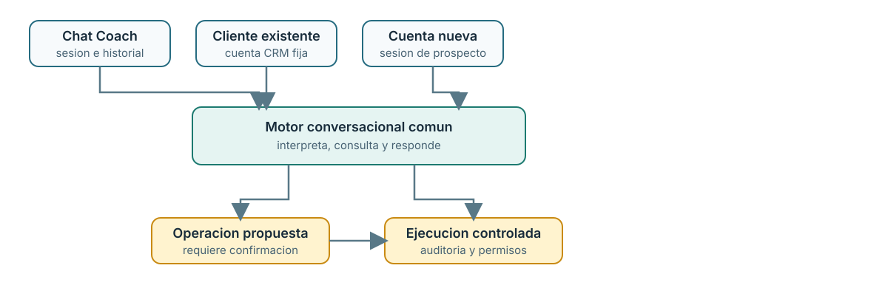
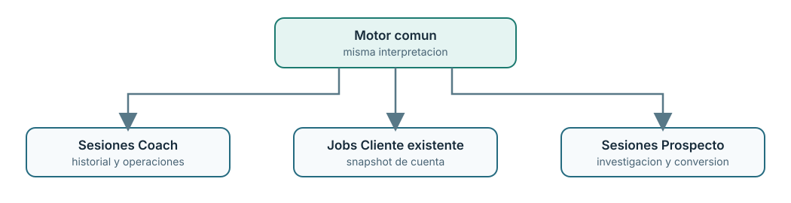
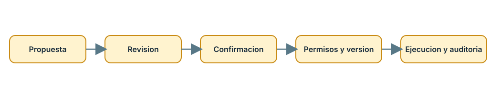

# Arquitectura Mi Coach

## 1. Proposito

Mi Coach organiza la experiencia en cinco espacios de trabajo:

- **Resumen:** indicadores de cuota y pipeline, junto con el análisis de situación comercial y prioridades del vendedor.
- **Coach:** asesoría comercial conversacional con contexto, historial y operaciones.
- **Cliente existente:** análisis de una cuenta CRM autorizada, riesgos y oportunidades de desarrollo.
- **Cuenta nueva:** investigación de un prospecto antes de convertirlo en registros CRM.
- **Administración:** gobierno de reglas, permisos y configuración de los espacios de Mi Coach.

Resumen presenta indicadores de cuota y pipeline y puede iniciar un análisis asíncrono de situación comercial. Ese análisis prioriza riesgos y acciones sobre datos autorizados; no es una conversación ni modifica registros.

Coach, Cliente existente y Cuenta nueva son los tres canales conversacionales y comparten el motor de interpretación. Cada uno conserva su propio contexto, sesión, permisos y operaciones. Resumen y Administración son espacios distintos; no comparten sesiones de chat.

El flujo detallado de jobs, contexto, planificación IA, candidatos CRM y persistencia se describe en [Arquitectura del chat conversacional por canales](./arquitectura-chat-conversacional.md).

## 2. Vista simple



Flujo comun:

1. El vendedor escribe una pregunta.
2. El adaptador aporta contexto y permisos.
3. El motor interpreta la pregunta y consulta herramientas autorizadas.
4. El motor devuelve una respuesta con evidencia y confianza.
5. Si corresponde, propone una operacion.
6. El vendedor revisa y confirma.
7. El sistema ejecuta y audita la operacion.

## 3. Motor comun

El motor esta en:

- `apps/api/src/coach/conversation-engine.js`
  
- `apps/api/src/coach/channel-intents.js`
- `apps/api/src/coach/entity-resolver.js`
- `apps/api/src/coach/read-tools.js`
- `apps/api/src/coach/crm-read-tools.js`
- `apps/api/src/coach/contract.js`

Recibe:

- Pregunta normalizada.
- Contexto actual.
- Historial opcional.
- Herramientas disponibles.
- Reglas del canal.
- Permisos efectivos.
  
- Politica de operaciones.

Devuelve:

- Respuesta.
- Entidades.
- Evidencia.
- Inferencias.
- Confianza.
- Aclaracion.
- Operaciones propuestas.
- Contexto actualizado.

El motor no administra sesiones ni conoce rutas HTTP.

### 3.1 Responsabilidades y fronteras

| Componente             | Responsabilidad                                                                                                                                       | No puede hacer                                                                                                    |
| ---------------------- | ----------------------------------------------------------------------------------------------------------------------------------------------------- | ----------------------------------------------------------------------------------------------------------------- |
| Planificador           | Interpretar pregunta e historial; proponer intención, entidad objetivo, cardinalidad, origen de referencia, filtros, consultas y aclaraciones usando candidatos y herramientas autorizados. | Recibir IDs CRM internos, objetos de permisos o reglas del servidor, ampliar herramientas, autorizar escrituras o ejecutar cambios. |
| Herramientas CRM       | Recuperar datos del snapshot o ejecutar lecturas permitidas dentro del alcance fijo del canal.                                                        | Cambiar registros ni ampliar la cuenta, sesión o conjunto de permisos.                                            |
| Reglas comerciales     | Aplicar filtros predeterminados, exigir evidencia y limitar respuestas u operaciones a los tipos configurados.                                        | Conceder permisos de usuario o sustituir la autorización final.                                                   |
| Reglas administrativas | Aportar guía editorial y criterios de calidad a la generación de respuesta dentro de su canal/proceso.                                                | Sustituir validadores estructurados o ampliar herramientas, permisos, alcance o tipos de operación del servidor.  |
| Políticas del servidor | Resolver permisos efectivos, aislamiento, acceso a entidades y autorización final de cada lectura/escritura.                                          | Delegar esas decisiones al prompt o a una respuesta del modelo.                                                   |
| Interfaz               | Mostrar respuestas y aclaraciones; presentar operaciones como propuestas revisables.                                                                  | Interpretar una propuesta como un cambio ya ejecutado.                                                            |

El motor entrega al planificador solo el contrato de interpretación, el catálogo de intenciones, herramientas que ya pasaron los filtros del servidor y candidatos autorizados identificados con aliases opacos, no con IDs CRM. La salida del planificador se normaliza y vuelve a intersectarse con ese catálogo, las herramientas y el mapa privado de candidatos antes de consultar CRM.

### 3.2 Resolución conversacional de entidades

En Cliente existente, la resolución de referencias forma parte del plan estructurado; no depende de un detector de frases para decidir si se hereda una entidad. El planificador recibe la pregunta, el historial reciente, el contexto conversacional validado y los candidatos de la cuenta. Devuelve `referenceResolution` con:

- `targetType`: cuenta, oportunidad, contacto, lead, cotización o ninguno.
- `cardinality`: uno, varios, todos, ninguno o desconocido.
- `source`: mensaje actual, historial, contexto activo, alcance de cuenta o ninguna referencia.
- `candidateKeys`: aliases opacos de los candidatos elegidos; nunca IDs de CRM.

El servidor conserva en memoria el mapa alias → registro, valida que el candidato siga perteneciendo a la cuenta activa y que existan herramientas autorizadas para leerlo, y solo entonces entrega el ID interno al read model. Si la IA marca una colección, no se fuerza una oportunidad singular; si una escritura no tiene un único destino válido, se pide aclaración. Los permisos, el ownership y la confirmación siguen siendo decisiones del servidor. La interpretación de fechas y periodos explícitos permanece determinista, pero no selecciona entidades.

Las instrucciones administrativas de texto libre orientan la respuesta, pero no son una fuente de autorización ni un validador determinista. Todo criterio que deba ser obligatorio se implementa en reglas comerciales estructuradas o en un validador del servidor. Las escrituras se filtran por la política efectiva, se validan en servicios controlados contra permisos de dominio, entidad y canal, y después se guardan como propuestas que requieren revisión/confirmación explícita antes de ejecutar y auditar.

## 4. Adaptadores

### 4.1 Coach

Archivo principal:

- `apps/api/src/coach/coach-adapter.js`

Conserva:

- Sesion e historial.
- Contexto de cuenta, oportunidad, contacto o lead.
- Reglas especificas del Coach.
- Operaciones comerciales completas.
- Confirmacion, handoff, ejecucion y reversa.
- Persistencia y observabilidad.

Entrada principal:

- `POST /api/mi-agent/coach`

El gateway del Coach se encuentra en:

- `apps/api/src/coach/agent-gateway.js`

### 4.2 Cliente existente

Archivo principal:

- `apps/api/src/commercial-intelligence/customer-chat-adapter.js`

Aporta:

- Una cuenta CRM fija.
- Snapshot CRM autorizado.
- Contexto de sesión validado y candidatos con aliases opacos para el planificador IA.
- Cuentas, oportunidades, contactos e interacciones.
- El mismo catalogo de herramientas de lectura que Coach, ejecutado solo sobre datos de la cuenta autorizada.
- Pipeline, leads relacionados, actividades y readiness de oportunidades de esa cuenta.
- Lectura de contenido de cotizaciones, sujeta a permisos de oportunidades/cotizaciones y ownership.
- Investigacion publica opcional.
- Operaciones controladas permitidas por canal y dominio, siempre limitadas a la cuenta autorizada y sujetas a permisos y confirmacion.

El alcance funcional, la matriz de permisos y el comportamiento esperado se definen en [Chat de Cliente existente](./chat-cliente-existente-alcance.md).

Cliente existente conserva `searchInteractions` como herramienta adicional. Ninguna herramienta de lectura puede ampliar el snapshot a otras cuentas.

Entrada principal:

- `POST /api/commercial-intelligence/account-chat/jobs`

No comparte sesion ni historial con Coach. Usa jobs propios de inteligencia comercial.

### 4.3 Cuenta nueva

Archivo principal:

- `apps/api/src/prospect-research/prospect-chat-adapter.js`

Aporta:

- Datos ingresados del prospecto.
- Hallazgos y evidencias publicas.
- Contactos objetivo.
- Hipotesis de oportunidad.
- Investigacion publica opcional.
- Propuestas de conversion siempre confirmables.

Entrada conversacional:

- `POST /api/prospect-research/sessions/:sessionId/chat`

Las conversiones a cuenta, contacto, lead u oportunidad siguen pasando por los endpoints de conversion existentes. El prospecto no se considera una cuenta CRM hasta que el vendedor confirma la conversion.

## 5. Sesiones y persistencia


Las sesiones no se mezclan:

- Coach conserva historial conversacional.
- Cliente existente conserva jobs y resultados de cuenta.
- Cuenta nueva conserva una sesion de prospeccion.

## 6. Reglas comunes

Estas reglas aplican a los tres chats:

- `activada` no significa necesariamente `abierta`.
- Las oportunidades `ganada`, `perdida` o `anulada` son historicas.
- Una solicitud plural devuelve una coleccion, no pide seleccionar un registro individual.
- Un nombre exacto de oportunidad tiene prioridad sobre una coincidencia por cuenta.
- Una solicitud de correo se interpreta como redaccion de correo.
- Los datos publicos no se presentan como registros CRM confirmados.
- La ausencia de un dato en el contexto no prueba que no exista en el CRM.
- Toda escritura requiere propuesta y confirmacion.
- Las operaciones deben respetar permisos y alcance del canal.

## 7. Politicas por canal

| Canal             | Alcance                   | Operaciones permitidas                                                                                         |
| ----------------- | ------------------------- | -------------------------------------------------------------------------------------------------------------- |
| Coach             | CRM general autorizado    | Actividades, campos, etapas, creaciones y handoffs                                                             |
| Cliente existente | Una cuenta CRM autorizada | Actividades, respuestas de etapa, resultados de lead y cambios de campos permitidos, segun politica y permisos |
| Cuenta nueva      | Una sesion de prospecto   | Crear o convertir cuenta, contacto, lead u oportunidad                                                         |

Las operaciones incluyen `sourceChannel` para impedir que una propuesta sea ejecutada desde otro canal.

La paridad de herramientas de lectura no implica paridad de escritura: cada canal conserva una lista de operaciones permitidas, sus permisos de dominio y su flujo de confirmacion. Cliente existente no ejecuta escrituras directamente desde el chat.

## 8. Contrato de operaciones

Las operaciones usan el contrato de `apps/api/src/coach/contract.js`.

Ejemplos:

- Cliente existente: `activity`.
- Cuenta nueva: `create_account`, `create_contact`, `create_opportunity`.
- Coach: operaciones comerciales completas.

Todas deben incluir:

- `requiresConfirmation: true`.
- Titulo.
- Evidencia.
- Entidad o payload.
- Politica de canal.
- Permisos aplicables.

El motor propone. Los servicios controlados revisan, confirman, ejecutan y auditan.

## 9. Operaciones controladas

El flujo es:


Nunca se ejecuta una escritura directamente desde el modelo.

## 10. Comparacion y calidad

Coach conserva una implementacion legacy para comparacion en modo `shadow`.

Se comparan:

- Intencion.
- Tipo de respuesta.
- Respuesta.
- Entidades.
- Evidencia y fundamentos.
- Herramientas.
- Contexto.
- Operaciones.
- Errores.

Una diferencia no explicada se considera regresion.

## 11. Pruebas

Regresion del Coach:

```text
npm run test:coach:baseline
```

Pruebas directas de adaptadores:

- `apps/api/test/coach-adapter.test.js`
- `apps/api/test/customer-chat-adapter.test.js`
- `apps/api/test/prospect-chat-adapter.test.js`
- `apps/api/test/operation-contract.test.js`

Pruebas de interfaz:

```text
cd apps/web
npm exec -- playwright test e2e/mi-agent-governance.spec.js
```

Esta suite cubre sesiones separadas, fundamentos, operaciones, conversiones y los tres espacios de trabajo.

## 12. Archivos principales

- Motor: `apps/api/src/coach/conversation-engine.js`
- Gateway Coach: `apps/api/src/coach/agent-gateway.js`
- Adaptador Coach: `apps/api/src/coach/coach-adapter.js`
- Adaptador Cliente existente: `apps/api/src/commercial-intelligence/customer-chat-adapter.js`
- Adaptador Cuenta nueva: `apps/api/src/prospect-research/prospect-chat-adapter.js`
- Contrato de operaciones: `apps/api/src/coach/operation-contract.js`
- Contrato de respuestas: `apps/api/src/coach/contract.js`
- Interfaz principal: `apps/web/src/MiAgentPage.jsx`
