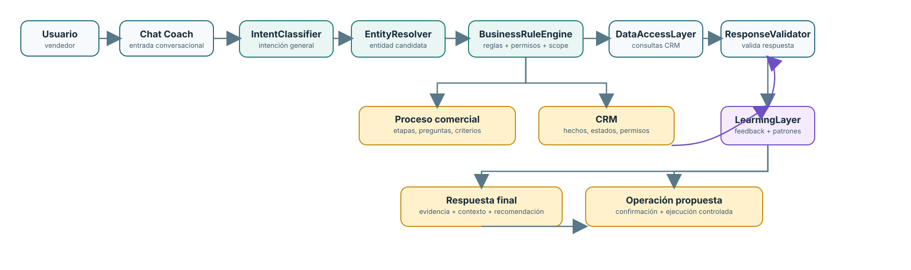

# Arquitectura del motor de Mi Coach

## 1. Objetivo

El motor de Mi Coach debe entender la pregunta del vendedor, identificar el contexto correcto, consultar hechos autorizados del CRM, aplicar las reglas del proceso comercial y responder con evidencia, sin depender de heuristicas frágiles ni de decisiones libres del modelo.

La arquitectura se organiza en capas para separar claramente:

- interpretacion del lenguaje,
- resolucion de entidades,
- definicion de negocio,
- consulta de datos,
- validacion de respuesta,
- mejora continua,
- ejecucion de operaciones.

## 2. Principio central

La IA no debe decidir la verdad del negocio.

La IA debe:

- interpretar la intencion general,
- sugerir una clasificacion,
- ayudar a validar si la respuesta responde la pregunta.

Las reglas deterministas deben:

- decidir si una entidad es valida,
- aplicar filtros del CRM,
- validar permisos,
- evaluar si una oportunidad es abierta, activa o historica,
- decidir si una operacion es permitida,
- decidir si una respuesta debe aclararse o rechazarse.

La capa de aprendizaje puede mejorar la interpretacion y la validacion, pero no reemplaza la autoridad de las reglas deterministas ni la fuente de verdad del CRM.

## 3. Fuentes de verdad

El motor usa dos fuentes principales de verdad:

### 3.1 Proceso comercial

Documentos base:

- `readme/proceso-comercial.md`
- `readme/preguntas-etapas-proceso-comercial.md`

Estas fuentes definen:

- etapas del proceso comercial,
- preguntas clave por etapa,
- criterios de avance,
- requisitos de validacion,
- riesgos y bloqueos,
- recomendaciones de siguiente paso.

### 3.2 CRM

El CRM es la fuente de hechos reales:

- cuentas,
- oportunidades,
- contactos,
- leads,
- actividades,
- pipeline,
- permisos,
- estados,
- etapas,
- historial.

La IA no sustituye al CRM. El CRM es la referencia real.

## 4. Arquitectura en 6 capas

La diferencia respecto a la version sin aprendizaje es la adicion de una capa supervisada que observa errores, patrones y feedback para mejorar la clasificacion y la validacion sin cambiar la fuente de verdad del negocio.

## 5. Capa 1: IntentClassifier

### Objetivo

Interpretar la pregunta del usuario a nivel semantico.

### Responsabilidades

- identificar el tipo general de consulta,
- distinguir si es cuenta, oportunidad, contacto, lead, riesgo, operacion, comparacion, resumen, etapa, fecha, o aclaracion,
- detectar la intencion: listar, detalle, resumen, preparacion, cambio, confirmacion,
- devolver una estructura semantica de entrada.

### No hace

- no decide la entidad final,
- no valida permisos,
- no aplica filtros de negocio,
- no resuelve la verdad del CRM.

## 6. Capa 2: EntityResolver

### Objetivo

Resolver la entidad concreta mencionada por el usuario.

### Responsabilidades

- reconocer nombres de cuenta, oportunidad, contacto y lead,
- comparar candidatos,
- detectar ambiguedad,
- devolver la entidad mas probable o solicitar aclaracion.

### No hace

- no decide si la entidad es valida para el usuario,
- no decide el filtro de cierre, etapa o estado,
- no resuelve la parte comercial.

## 7. Capa 3: BusinessRuleEngine

### Objetivo

Aplicar reglas deterministas del negocio.

### Responsabilidades

- determinar si una oportunidad es abierta, activa, historica o terminal,
- aplicar filtros de lifecycle, stage, commercial status, activation status,
- aplicar condiciones por canal,
- validar permisos y ownership,
- validar si el usuario puede consultar o modificar esa entidad,
- decidir si hay que pedir aclaracion,
- decidir si una operacion es permitida,
- decidir si los datos cumplen el proceso comercial requerido.

### Entrada

- intencion general,
- entidad resuelta,
- contexto de canal,
- permisos del usuario,
- reglas de negocio administradas.

### Salida

- filtros concretos,
- scope aplicado,
- operacion validada,
- necesidad de aclaracion,
- bloqueo por permisos o alcance.

## 8. Capa 4: DataAccessLayer

### Objetivo

consultar hechos reales del CRM y devolver estructuras validadas.

### Responsabilidades

- ejecutar queries y herramientas para cuentas, oportunidades, contactos y leads,
- retornar solo datos autorizados,
- devolver datos estructurados y verificables,
- mantener la separacion entre hechos y opiniones.

Coach y Cliente existente reutilizan el catalogo de lectura para cuentas, oportunidades, detalle de oportunidad, actividades, cotizaciones, contactos, leads, pipeline y readiness. Cliente existente ejecuta ese catalogo con un snapshot limitado a la cuenta autorizada; no puede consultar registros de otra cuenta. El permiso del usuario y el ownership se validan en el servidor.

La lectura conversacional de cotizaciones obtiene la ultima version autorizada y proyecta solo contenido comercial. No incluye costos internos, margenes ni notas internas. La paridad de lectura entre canales no cambia sus politicas de escritura.

### No hace

- no interpreta la pregunta,
- no decide la intencion,
- no inventa respuestas,
- no decide si una respuesta es buena.

## 9. Capa 5: ResponseValidator

### Objetivo

validar la coherencia final de la respuesta antes de entregarla.

### Responsabilidades

- verificar que la respuesta responde la pregunta,
- verificar que la entidad es la correcta,
- verificar que los filtros fueron aplicados,
- verificar que no se mezclaron entidades,
- verificar que se usaron hechos del CRM,
- verificar que no hay contradiccion con el proceso comercial,
- revisar si falta evidencia,
- detectar si debe pedirse aclaracion o recomendar un siguiente paso.

### Sugerencia

La validacion puede usar IA como auditor semantico, pero la autoridad final sigue siendo la capa de reglas y el CRM.

## 10. Capa 6: LearningLayer

### Objetivo

Mejorar la calidad del motor mediante feedback, observacion y patrones de error, sin reemplazar la autoridad de negocio.

### Responsabilidades

- registrar consultas que fueron mal interpretadas,
- detectar patrones de ambiguedad repetida,
- comparar la respuesta final con la intencion original,
- identificar errores de entidad, filtro o validacion,
- sugerir nuevos alias, reglas o ajustes de clasificacion,
- sugerir mejoras en los mensajes de aclaracion,
- detectar sesiones donde la respuesta no tuvo suficiente evidencia.

### No hace

- no decide permisos,
- no decide estados ni etapas del negocio,
- no reemplaza la BusinessRuleEngine,
- no ejecuta operacion ni modifica datos,
- no sustituye la fuente de verdad del CRM.

### Uso recomendado

La capa de aprendizaje debe operar como un sistema supervisado:

- recoge feedback y resultados observados,
- sugiere cambios,
- el negocio o el administrador aprueba la regla,
- los cambios pasan por validacion y pruebas antes de activarse.

## 11. Flujo de lectura

El flujo de consulta debe seguir este orden:

1. El usuario escribe la pregunta.
2. `IntentClassifier` interpreta la intencion general.
3. `EntityResolver` identifica la entidad mencionada.
4. `BusinessRuleEngine` aplica reglas del proceso comercial y del CRM.
5. `DataAccessLayer` consulta hechos autorizados.
6. `ResponseValidator` valida si la respuesta es coherente y suficiente.
7. `LearningLayer` registra patrones, feedback y observaciones de calidad.
8. Se responde al usuario con evidencia y contexto.

## 12. Flujo de operacion

Cuando la pregunta implica accion:

1. Se identifica la operacion solicitada.
2. `BusinessRuleEngine` valida que el canal permite esa operacion.
3. Se valida el alcance y permisos.
4. La operacion se propone, no se ejecuta de inmediato.
5. El usuario confirma.
6. Se ejecuta la accion en el servicio controlado.
7. Se registra auditoria y resultado.

## 13. Reglas de gobierno

- La IA no es la fuente de verdad.
- El CRM es la fuente de hechos.
- El proceso comercial es la fuente de contexto y criterios.
- Las reglas del negocio deben estar en una capa administrable.
- La capa de aprendizaje no reemplaza la capa de reglas.
- El frontend no debe decidir la semantica del negocio.
- Las respuestas deben ser evidenciables.

## 14. Gobierno operativo de reglas

Las reglas se almacenan por canal y proceso en `mi_coach_business_rules`. La administracion requiere `mi_coach.admin`; lectura, actualizacion y restablecimiento quedan registrados en auditoria.

El panel de gobierno de Mi Coach permite seleccionar el canal y proceso, editar el contrato validado y volver a los valores predeterminados. Los canales soportados son `coach`, `customer_account` y `prospect`. El motor selecciona el proceso de la intencion clasificada en Coach, y usa `account_chat` o `prospect_chat` en los adaptadores correspondientes; cuando no hay una regla especifica, aplica la configuracion predeterminada del canal.

La configuracion puede estrechar alcance de lectura y tipos de operacion, definir filtros predeterminados y agregar aliases. No puede desactivar validacion de permisos, resolucion de entidad ni evidencia. Las reglas se aplican antes de exponer datos al modelo; el CRM y los permisos efectivos siguen siendo autoridad.

Administracion incluye ademas un catalogo CRUD de reglas conversacionales: las reglas comunes aplican a los tres chats y las reglas especificas se filtran por canal y proceso. Cada regla tiene nombre, instruccion, orden y estado activo; las reglas activas se incluyen en la primera respuesta del modelo y en las pasadas posteriores con herramientas. Este catalogo orienta la interpretacion, pero no sustituye filtros, permisos, ownership, politicas de operacion ni validaciones deterministas del servidor. Altas, ediciones y eliminaciones requieren `mi_coach.admin` y quedan auditadas.

Gobierno tambien expone controles deterministas por dominio. En oportunidades, Administracion puede elegir las etapas del pipeline calificado y del monto comprometido desde el catalogo vigente; el monto comprometido debe ser subconjunto del pipeline calificado. La definicion de oportunidad abierta permanece protegida y comun: estado comercial `en_proceso` y activacion `activada`; las etapas no cambian ese ciclo de vida. Las reglas de lectura y tipos de operacion se pueden estrechar por canal, pero permisos, ownership y las restricciones base de cada canal no se pueden ampliar desde la interfaz.

## 15. Adaptadores y aislamiento por canal

Los tres adaptadores reutilizan `runConversationEngine`, pero construyen su propio snapshot, herramientas y politica:

- `coach` usa la sesion conversacional del Coach y jobs `mi_coach_chat`.
- `customer_account` usa el snapshot autorizado de una cuenta, con cuenta/oportunidad/contacto fijos; cada conversación tiene un registro propio en `customer_intelligence_chat_sessions`, ligado al usuario y al contexto CRM, con un máximo de ocho mensajes.
- `prospect` representa el canal de Cuenta nueva; usa exclusivamente la sesion de prospeccion propiedad del usuario, guarda hasta dieciseis mensajes y conserva las conversiones como operaciones propuestas que requieren confirmacion.

Cliente existente crea una sesion con `POST /account-chat/sessions`, la consulta con `GET /account-chat/sessions/:sessionId` y la envia al crear cada job de chat. El backend valida propietario y contexto, y guarda cada turno junto con el resultado del job en una transaccion. La interfaz conserva el identificador en `sessionStorage` por cuenta y permite iniciar una conversación nueva.

Cada herramienta del Coach declara sus permisos de dominio; un catálogo vacio deniega todas las llamadas. El motor etiqueta las llamadas de IA por canal y tipo de job, no aplica el ranking exclusivo de Coach a otros chats y filtra las operaciones por `sourceChannel` y tipos permitidos. Las operaciones de un canal no se guardan en sesiones de otro. Si el usuario solicita preparar una actividad desde Cliente existente, la aplicacion crea una nueva sesion Coach con el contexto autorizado de esa oportunidad; no reutiliza el historial de Cliente existente ni una sesion Coach previa. Las conversiones de Cuenta nueva permanecen en sus rutas y persistencia de Prospeccion.

Los adaptadores no comparten historial ni cargan entidades de otro canal en su contexto.

- La validacion final debe confirmar que la respuesta se corresponde con la pregunta.
- Los cambios sugeridos por aprendizaje deben pasar por revision y pruebas antes de activarse.

## 16. Observabilidad del motor

Cada turno produce una traza de calidad asociada a canal, proceso, usuario, sesion y job. Registra intención, tipos e IDs de entidad resuelta, ambigüedad, reglas/filtros aplicados, validación, evidencia, herramientas, operaciones propuestas/rechazadas, latencia y código de error. No conserva el texto libre de la pregunta.

El feedback se asocia al `qualityTraceId` y solo puede enviarlo el propietario de la traza. La categoría separa errores de intención, entidad, respuesta y evidencia. Las métricas de accuracy usan feedback etiquetado y muestran “sin medición” mientras no exista una muestra.

El dashboard agrupa por canal y proceso las tasas de clasificación correcta, calidad de entidad, aclaración, respuesta inválida, rechazo de operaciones y corrección por feedback. La accuracy de intención/entidad usa feedback positivo/(positivo + negativo) de esa categoría; la tasa de corrección usa feedback marcado como corrección/feedback recibido. Sin denominador se muestra “sin medición”, no 0%. Las tasas de aclaración e inválidas usan turnos; el rechazo de operaciones usa propuestas. Las señales de regresión se presentan por proceso para corregirlas en la capa responsable.

Los tres canales ejecutan siempre el motor nuevo; la selección por porcentaje, allowlist o modo legacy/shadow ya no interviene en la ruta de conversación ni se expone en Administración. El dashboard conserva las métricas por canal y proceso para observar calidad y corregir reglas. Un error de ejecución puede activar el fallback local de resiliencia del canal, pero no una selección administrativa de motor.

## 17. Expansion del catalogo comercial

Los casos nuevos se incorporan con IDs estables en `coach/case-catalog.js`; sus frases se normalizan sin acentos y se mantienen como un catálogo curado, no como reglas regex abiertas. La Fase 6 añade consultas gobernadas para riesgos de etapa, preparación, preguntas de etapa, actividades, stakeholders/contactos y resumen de cuenta. Las consultas de actividad requieren una oportunidad seleccionada; de lo contrario se solicita aclaración. Contactos y cuentas invocan herramientas del catálogo autorizado, y las preguntas de etapa alimentan la evaluación determinista `stageReadiness`.

El `caseId` viaja en la clasificación y la traza de calidad, permitiendo comparar aclaraciones, respuestas inválidas y feedback por caso. Cada nuevo caso debe añadir ejemplos de regresión con entidad/filtro esperado antes de habilitarse; la verdad comercial sigue proveniendo del CRM y del proceso configurado.

## 13. Conclusiones

La arquitectura del motor debe ser determinista en la parte que decide negocio y permisos, y semantica en la parte que interpreta lenguaje.

Eso permite:

- reducir correcciones por casos aislados,
- mantener la logica del proceso comercial centralizada,
- proteger el CRM y los permisos,
- permitir que la IA mejore la calidad de la respuesta sin reemplazar la verdad de negocio.
