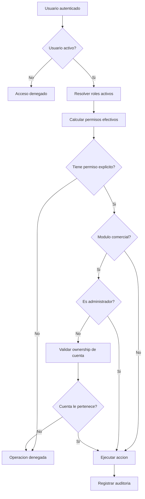
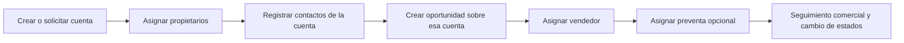

# Logica de negocio

## Proposito

Este documento resume las reglas funcionales transversales del CRM y conecta la
logica de usuarios, roles, cuentas, contactos, oportunidades y auditoria.

No sustituye la documentacion por modulo. Su objetivo es explicar como opera el
sistema como un todo y que decisiones de negocio estan implementadas hoy.

## Principios del sistema

- Seguridad por defecto: si un usuario no tiene permiso explicito, no puede ejecutar la accion.
- Trazabilidad obligatoria: las operaciones relevantes quedan auditadas.
- Activacion controlada: crear y solicitar no son equivalentes; cada permiso define el estado inicial del recurso.
- Ownership operativo: para cuentas, contactos y oportunidades, el acceso real depende de permisos y de pertenencia comercial.
- Catalogos maestros: tipos, estados y clasificaciones se toman desde catalogos controlados y no desde texto libre.

## Modelo funcional general

El CRM sigue este flujo base:

1. Un usuario autenticado obtiene permisos efectivos desde sus roles activos.
2. Segun esos permisos, puede consultar, crear, solicitar, editar o cambiar estado de entidades.
3. En los modulos comerciales, los administradores ven todo; los no administradores quedan limitados a las cuentas que poseen.
4. Cada cambio relevante registra auditoria con actor, entidad afectada, resultado y delta de campos.

## Diagramas de flujo

### Flujo operativo transversal

### Flujo comercial minimo

## Autenticacion y acceso

### Login y estado del usuario

- Solo usuarios con `status = active` pueden operar el sistema.
- Un token JWT valido no basta por si solo: en cada request se recarga el contexto del usuario y se valida que siga activo.
- Si el usuario fue desactivado, el backend responde como usuario inactivo aunque el token no haya expirado.

### Invitaciones y set password

- La creacion de usuarios y el reinicio de acceso usan token temporal opaco de un solo uso.
- El token tiene vigencia configurable.
- El frontend consume el token para mostrar contexto y permitir definir contrasena.
- El token se invalida al usarse.
- Si SMTP no esta configurado o falla, el sistema no bloquea la operacion principal: devuelve el enlace para resolucion manual.

## RBAC y permisos

### Roles activos

- Los permisos efectivos de un usuario salen de la union de permisos asignados a sus roles activos.
- Si un rol esta inactivo, deja de aportar permisos aunque siga asignado al usuario.

### Administrador

- El rol `Administrador` funciona como bypass de autorizacion general.
- Aun asi, en la practica comercial se mantienen reglas explicitas en ciertos modulos para distinguir entre crear, solicitar y cambiar estado.
- En cuentas, contactos y oportunidades existe una separacion deliberada entre permisos de lectura, creacion, solicitud y actualizacion.

### Patron create vs request

En modulos comerciales existe la siguiente regla:

- `*.create`: crea el recurso en estado activo.
- `*.request`: crea el recurso en estado pendiente.
- `*.update`: permite editar el recurso.
- Solo `*.create` habilita cambios de estado de activacion.

Este patron aplica actualmente a:

- cuentas
- contactos
- oportunidades

## Usuarios

### Alta y mantenimiento

- Un usuario puede crearse activo o inactivo.
- La alta no depende del correo exitoso; depende de la insercion correcta del usuario y sus roles.
- Los roles pueden asignarse desde el alta o mantenerse despues.

### Desactivacion

- Desactivar un usuario le corta el acceso al sistema.
- La desactivacion no elimina historial ni auditoria.
- Si el usuario es el ultimo propietario activo de una o mas cuentas activas, la desactivacion se bloquea.
- El objetivo es evitar cuentas activas sin responsable comercial vigente.
- Las acciones sensibles de acceso, como activar, desactivar o reiniciar contrasena, requieren confirmacion explicita en la interfaz.

### Impacto comercial del estado

- Un usuario inactivo puede seguir apareciendo en relaciones historicas.
- En cuentas, si sigue asignado como propietario junto con otro propietario activo, se muestra como `Nombre (inactivo)`.
- No se ofrece como opcion nueva en catalogos de seleccion de propietarios.

## Cuentas

### Naturaleza de la entidad

La cuenta representa una organizacion o cliente potencial y es la raiz operativa
de los modulos de contactos y oportunidades.

### Propietarios

- Toda cuenta debe tener al menos un propietario.
- La propiedad es N:M entre cuentas y usuarios.
- Los propietarios determinan visibilidad y operacion para usuarios no administradores.
- Una cuenta activa no debe quedar sin propietarios activos.
- Los propietarios inactivos se conservan por trazabilidad, pero se distinguen visualmente.

### Estados

Estados actuales:

- activada
- desactivada
- pendiente_activacion

Reglas:

- `cuentas.create` crea activada.
- `cuentas.request` crea pendiente.
- Solo `cuentas.create` puede cambiar el estado despues.
- Una cuenta no puede desactivarse si tiene contactos activos.
- Una cuenta no puede marcarse como pendiente si tiene contactos activos o desactivados.

### Alcance de acceso

- Administrador: ve y opera todas las cuentas.
- No administrador: solo ve y opera cuentas de las que es propietario.

## Contactos

### Dependencia funcional

- Todo contacto pertenece a una cuenta.
- El contacto es parte del contexto comercial de esa cuenta.

### Reglas de negocio

- No existe contacto sin cuenta.
- Puede tener jerarquia opcional: jefe directo e influencia.
- Usa catalogos controlados para participacion en compra, tipo de relacion, situacion laboral y estado.

### Estados y permisos

- `contactos.create` crea activado.
- `contactos.request` crea pendiente.
- Solo `contactos.create` cambia estado despues.
- Un contacto no puede desactivarse si tiene oportunidades activas.
- Un contacto no puede marcarse como pendiente si tiene oportunidades activas o desactivadas.

### Alcance de acceso

- Administrador: ve y opera todos los contactos.
- No administrador: solo los contactos de cuentas que le pertenecen.

## Oportunidades

### Dependencia funcional

- Toda oportunidad pertenece a una cuenta.
- Toda oportunidad referencia un contacto de esa misma cuenta.
- No se permite mezclar cuenta y contacto de distintas cuentas.

### Responsables comerciales

- El vendedor es obligatorio y debe ser un usuario activo con rol `Vendedor`.
- El ingeniero preventa es opcional, pero si se asigna debe ser un usuario activo con rol `Preventa`.

### Estados y permisos

- `oportunidades.create` crea activada.
- `oportunidades.request` crea pendiente.
- Solo `oportunidades.create` cambia estado despues.

### Alcance de acceso

- Administrador: ve y opera todas las oportunidades.
- No administrador: solo oportunidades de cuentas de las que es propietario.

## Roles y catalogos

### Roles

- Los roles agrupan permisos por capacidad funcional.
- El sistema permite activarlos o desactivarlos.
- Desactivar un rol no elimina su asignacion historica; solo deja de aportar permisos.
- Un rol no puede desactivarse mientras tenga usuarios asignados.
- Para desactivar un rol, primero deben retirarse o reasignarse sus usuarios.

### Catalogos

- Los catalogos representan vocabulario controlado del negocio.
- Evitan valores libres en estados, clasificaciones y listas de apoyo.
- El frontend debe consumir ids de catalogo y no inferirlos manualmente salvo para defaults conocidos.

## Auditoria

### Que se audita

Actualmente se auditan eventos relevantes de:

- autenticacion
- usuarios
- roles
- cuentas
- invitaciones y reinicios de acceso

### Objetivo

- reconstruir quien hizo que
- entender cambios de estado
- revisar altas, ediciones y errores
- soportar trazabilidad operativa y de seguridad

### Restricciones

- no se guardan secretos
- no se persisten tokens planos
- se registra solo el contexto funcional necesario

## Reglas transversales clave

1. Un usuario inactivo no puede entrar ni operar aunque conserve token previo.
2. Un rol inactivo no aporta permisos.
3. Un recurso comercial creado con permiso `request` nace pendiente, no activo.
4. Los cambios de estado de recursos comerciales requieren el permiso `create` del modulo correspondiente.
5. La visibilidad comercial de no administradores depende de ownership de cuenta.
6. Las dependencias comerciales bloquean regresiones de estado: una cuenta no puede volver a pendiente si ya tiene contactos u oportunidades vigentes, y un contacto no puede desactivarse ni volver a pendiente si mantiene oportunidades activas o desactivadas segun el caso.
6. Contactos y oportunidades heredan el alcance de la cuenta a la que pertenecen.
7. No se puede desactivar un usuario si eso deja cuentas activas sin propietarios activos.
8. No se puede desactivar una cuenta si tiene contactos activos.
9. No se puede marcar una cuenta como pendiente si tiene contactos activos o desactivados.
10. No se puede desactivar un rol si tiene usuarios asignados.
11. La auditoria es parte del comportamiento esperado, no un extra opcional.

## Flujo de negocio resumido

### Flujo comercial minimo

1. Se crea o solicita una cuenta.
2. Se asignan uno o varios propietarios.
3. Sobre esa cuenta se registran contactos.
4. Sobre esa misma cuenta y uno de sus contactos se registran oportunidades.
5. Los responsables comerciales trabajan solo dentro de su cartera visible.

### Flujo de administracion de acceso

1. Un administrador crea un usuario.
2. El sistema genera invitacion o enlace manual de set password.
3. El usuario define su contrasena.
4. Los permisos reales dependen de los roles activos asignados.
5. Si el usuario deja de operar, puede desactivarse siempre que no deje cuentas activas sin cobertura.
6. Si un rol deja de usarse, solo puede desactivarse cuando ya no tenga usuarios asignados.

## Politicas operativas para negocio

Esta seccion traduce la implementacion actual a reglas operativas faciles de aplicar
por lideres comerciales, administradores funcionales y responsables de operacion.

### Politica de altas de usuario

- Todo usuario nuevo puede crearse aunque el correo no salga inmediatamente.
- La operacion correcta es crear al usuario, asignarle rol y luego verificar si recibio invitacion o si debe usarse el enlace manual.
- No debe compartirse una cuenta entre varias personas; cada persona debe tener su propio usuario.

### Politica de activacion y desactivacion

- Un usuario inactivo no debe considerarse disponible para operar oportunidades, cuentas o contactos.
- Antes de desactivar a un usuario comercial, debe revisarse si sigue siendo responsable de cuentas activas.
- Si todavia es el ultimo propietario activo de alguna cuenta, primero debe reasignarse esa cartera.
- Activar, desactivar o reiniciar acceso son acciones sensibles y deben confirmarse antes de ejecutarse.

### Politica de roles

- Un rol activo puede seguir asignado a multiples usuarios mientras define una capacidad vigente del negocio.
- Si un rol ya no debe usarse, primero se deben retirar sus usuarios o migrarlos a otro rol equivalente.
- Un rol con usuarios asignados no puede desactivarse porque dejaria relaciones de acceso en estado ambiguo.
- Los roles inactivos conservan trazabilidad historica, pero ya no aportan permisos efectivos.

### Politica de propiedad de cuentas

- Toda cuenta activa debe tener al menos un propietario activo.
- Puede tener varios propietarios cuando la gestion comercial es compartida.
- Si un propietario sale de operacion pero la cuenta sigue atendida por otro, se conserva la relacion historica y se marca como inactivo.
- La propiedad de cuenta define la cartera visible para usuarios no administradores.
- Si una cuenta tiene contactos activos, no debe desactivarse hasta cerrar o reordenar esos contactos.
- Si una cuenta ya tiene contactos activos o desactivados, no debe volver a estado pendiente.

### Politica de creacion vs solicitud

- Crear significa que el recurso nace operativo.
- Solicitar significa que el recurso nace pendiente y requiere gestion posterior.
- Esta diferencia aplica a cuentas, contactos y oportunidades.
- No todos los usuarios con capacidad de captura tienen capacidad de activacion.

### Politica de contactos

- No debe registrarse un contacto sin vincularlo a una cuenta valida.
- El contacto debe representar una relacion comercial util dentro de esa cuenta.
- La jerarquia de jefe o influencia debe usarse solo si aporta contexto comercial real.

### Politica de oportunidades

- Toda oportunidad debe nacer ligada a una cuenta y a un contacto de esa misma cuenta.
- El vendedor siempre es obligatorio.
- El preventa se registra solo cuando realmente participa en el ciclo comercial.
- No deben crearse oportunidades aisladas sin cuenta o con contactos cruzados de otra organizacion.

### Politica de auditoria

- Cambios sensibles de acceso, estado o configuracion deben quedar en auditoria.
- La auditoria debe usarse para seguimiento operativo y aclaracion de cambios, no como sustituto de aprobaciones formales.
- Si una accion no deja rastro cuando deberia, debe tratarse como gap funcional.

### Politica de catalogos

- Los estados y clasificaciones deben usarse desde catalogos oficiales.
- No debe improvisarse vocabulario por fuera de los catalogos si el concepto ya existe en el sistema.
- Si negocio necesita una categoria nueva, debe agregarse formalmente y no resolverse con texto libre.

## Limites actuales del modelo

- El ownership comercial nace en cuentas; no existe ownership directo de contactos u oportunidades fuera de la cuenta.
- Los estados de activacion son operativos, no reemplazan un workflow completo de aprobaciones.
- La auditoria es funcional y de aplicacion; no sustituye controles de base de datos ni politicas externas de cumplimiento.

## Documentos relacionados

- [README interno](./README.md)
- [Usuarios](./usuarios.md)
- [Roles y permisos](./roles.md)
- [Cuentas](./cuentas.md)
- [Contactos](./contactos.md)
- [Oportunidades](./oportunidades.md)
- [Auditoria](./auditoria.md)
- [Arquitectura de la aplicacion](./arquitectura-aplicacion.md)
- [Base de datos](./base-de-datos.md)