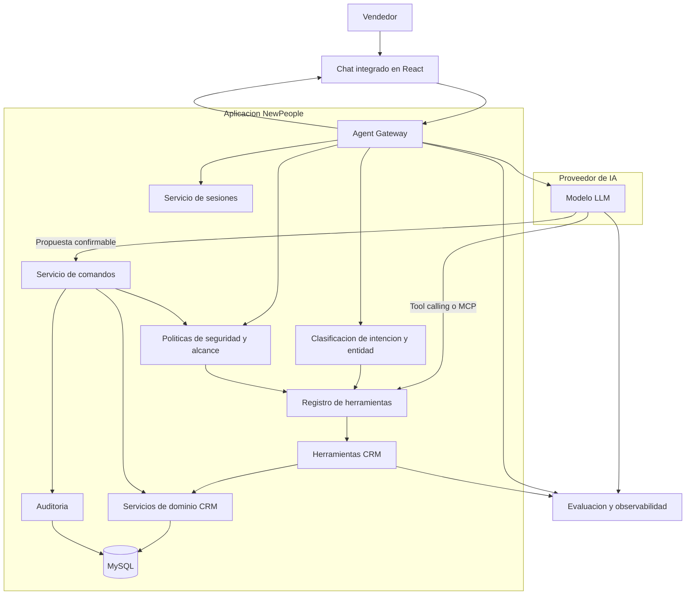
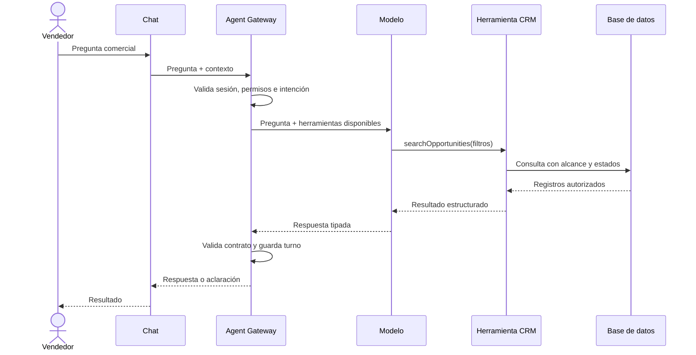
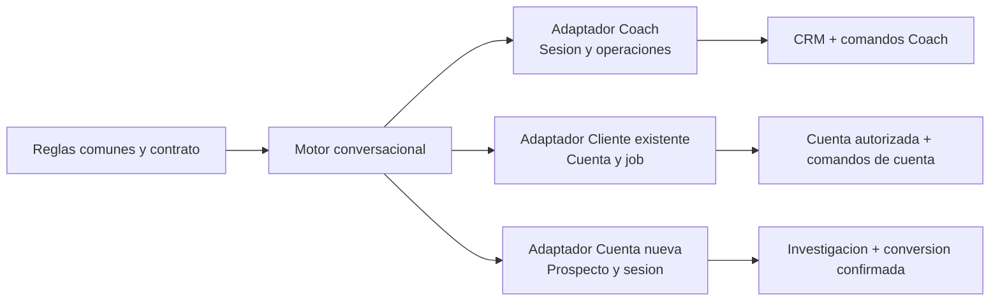

# Motor Conversacional Mi Coach

Este documento define el motor conversacional y conserva el objetivo original del Chat Coach: ser un asesor comercial confiable para el vendedor. Describe reglas, contratos, herramientas, sesiones, operaciones controladas y el estado implementado del motor.

## 1. Objetivo

Mi Coach debe ayudar al vendedor a:

- Entender la situación de una cuenta, contacto, lead u oportunidad.
- Avanzar una oportunidad con disciplina a través de las etapas del proceso comercial.
- Identificar riesgos, bloqueos, necesidades, información faltante y próximos pasos.
- Consultar información de cuentas, contactos, leads y oportunidades.
- Preparar reuniones, llamadas, demostraciones, negociaciones y seguimientos.
- Iniciar la creación de cuentas, contactos, oportunidades, leads, mapeos de contactos, cotizaciones, propuestas y actividades.
- Proponer actualizaciones de campos de los registros permitidos.
- Proponer respuestas para preguntas de etapa cuando una afirmación del vendedor coincide claramente con una pregunta existente.
- Mantener el contexto de la conversación sin mezclar cuentas, oportunidades o usuarios.
- Pedir una aclaración útil cuando existan varias coincidencias.

El objetivo no es construir un chat que tenga acceso indiscriminado al CRM. El objetivo es construir un agente comercial que razone sobre resultados confiables obtenidos mediante herramientas controladas.

### 1.1 Alcance funcional

La arquitectura debe soportar el alcance funcional definido para Mi Coach:

- Consultar cuentas, contactos, leads, oportunidades, actividades y pipeline.
- Entender la situación de una entidad y detectar riesgos, bloqueos e información faltante.
- Preparar llamadas, reuniones, demostraciones, negociaciones y seguimientos.
- Evaluar si una oportunidad está lista para avanzar en el proceso comercial.
- Proponer la creación o actualización de registros sin guardar cambios automáticamente.
- Transferir al vendedor a los módulos oficiales para completar formularios, validaciones y aprobaciones.
- Recuperar contexto y operaciones pendientes cuando el vendedor regrese a la conversación.

Mi Coach orienta y prepara; no sustituye el criterio del vendedor ni la responsabilidad de los módulos CRM.

### 1.2 Proceso comercial como marco de asesoría

Las recomendaciones deben relacionarse con la etapa actual, sus preguntas, resultados esperados y evidencia disponible. El proceso comercial contempla:

1. Contacto Inicial.
2. Identificación de Oportunidad.
3. Desarrollo.
4. Cotización.
5. Demostración.
6. Negociación.
7. Waiting.

Una evaluación de preparación de etapa debe distinguir:

- Avances confirmados.
- Preguntas o datos pendientes.
- Riesgos y bloqueos.
- Contactos o roles todavía no identificados.
- Siguiente paso, responsable, fecha objetivo y criterio de éxito.
- Recomendación de avanzar, avanzar con cautela o permanecer en la etapa.

La existencia de una actividad, cotización o solicitud del vendedor no demuestra por sí sola que la oportunidad esté lista para avanzar.

## 2. Principios de diseño

### 2.1 El CRM es la fuente de verdad

El modelo de IA no consulta MySQL directamente, no decide permisos y no determina por sí mismo si un registro está activo, desactivado, ganado, perdido o en una etapa específica.

La aplicación debe ser responsable de:

- Autenticación y autorización.
- Ownership y alcance comercial.
- Estados y etapas del proceso.
- Relaciones entre cuentas, oportunidades, contactos y leads.
- Escrituras, transacciones e idempotencia.
- Auditoría.

### 2.2 El modelo razona; las herramientas verifican

El modelo debe interpretar el lenguaje del vendedor y elegir la herramienta correcta. Las herramientas deben consultar datos reales y devolver resultados estructurados.

No se debe enviar un snapshot indiscriminado esperando que el modelo descubra todas las relaciones comerciales por texto libre.

### 2.3 La interfaz no debe reinterpretar al agente

El backend debe devolver respuestas estructuradas. React debe renderizar esas respuestas, no reconstruir una aclaración distinta ni volver a clasificar candidatos como cuentas, oportunidades o leads.

### 2.4 Consultar y modificar son flujos diferentes

Las consultas pueden resolverse directamente con datos autorizados. Las modificaciones siempre requieren:

1. Propuesta estructurada.
2. Confirmación explícita del vendedor.
3. Validación de permisos y versión.
4. Ejecución idempotente.
5. Auditoría.

### 2.5 Los errores deben ser visibles y recuperables

Cuando el agente no pueda resolver una entidad, debe explicar qué falta y mostrar opciones diferenciadas. No debe seleccionar una entidad parecida por su cuenta ni cambiar silenciosamente de oportunidad a lead.

### 2.6 El vendedor conserva el control

Toda creación o actualización debe seguir el flujo `pregunta -> propuesta -> revisión editable -> confirmación -> resultado`. El vendedor puede corregir o cancelar la propuesta antes de que el servicio de comandos la ejecute.

## 3. Arquitectura actual

La implementación actual ya contiene piezas útiles, pero varias responsabilidades están concentradas en pocos módulos:

- `apps/web/src/MiAgentPage.jsx` administra interfaz, estado del chat, contexto, restauración de sesiones, aclaraciones y operaciones.
- `apps/api/src/routes.mi-agent.js` concentra construcción de contexto, consultas del CRM, ejecución de jobs, interacción con IA, normalización de respuestas y rutas de operaciones.
- `apps/api/src/coach/entity-resolver.js` intenta resolver cuentas, oportunidades, contactos y leads a partir del texto.
- `apps/api/src/coach/service.js` persiste sesiones y operaciones pendientes.
- `apps/api/test` y `apps/web/e2e` cubren varios flujos, pero la cobertura de preguntas reales todavía debe ampliarse.

### 3.1 Limitaciones actuales

- La resolución de entidades depende demasiado de coincidencias textuales.
- Las oportunidades se buscan principalmente por su nombre, aunque el vendedor suele referirse a la cuenta asociada.
- Leads y oportunidades pueden competir como candidatos aunque la pregunta mencione explícitamente una oportunidad.
- Un snapshot grande mezcla datos de varios dominios y estados.
- La consulta, el razonamiento, la normalización y la ejecución están acoplados en la misma ruta.
- El frontend puede generar aclaraciones propias a partir del estado local.
- La sesión persiste en backend, pero el navegador también conserva el identificador y participa en la restauración.
- Las operaciones pendientes complican acciones simples como limpiar una conversación.
- Los casos de ambigüedad, duplicados, ownership y estados inactivos requieren pruebas específicas para no regresar.

## 4. Arquitectura objetivo




## 5. Componentes

### 5.1 Chat integrado

La interfaz debe ser una proyección del estado del agente. Sus responsabilidades son:

- Capturar la pregunta.
- Mostrar mensajes y resultados.
- Mostrar candidatos de una aclaración estructurada.
- Mostrar propuestas de acción.
- Solicitar confirmación.
- Mostrar errores, estado de carga y operaciones pendientes.

La interfaz no debe:

- Consultar directamente tablas del CRM.
- Decidir si una coincidencia es una oportunidad o un lead.
- Deducir estados comerciales.
- Rehacer la lógica de resolución del backend.

### 5.2 Agent Gateway

Es el punto de entrada único para las conversaciones del Coach. Debe:

- Cargar la sesión del usuario.
- Recibir la pregunta y el contexto explícito.
- Validar el formato de entrada.
- Coordinar la resolución de intención y entidades.
- Entregar al modelo únicamente herramientas disponibles para ese usuario.
- Validar la respuesta estructurada del modelo.
- Guardar el turno y el contexto resultante.
- Devolver un contrato estable al frontend.

El Gateway no debe convertirse en una nueva ruta monolítica. La consulta, resolución, comandos y persistencia deben estar separados por servicio.

### 5.3 Clasificación de intención y entidad

Antes de consultar datos se deben identificar:

- Tipo de solicitud: consulta, preparación, recomendación o acción.
- Entidad principal: cuenta, oportunidad, contacto, lead, actividad o pipeline.
- Entidades relacionadas.
- Filtros: etapa, estado, monto, fecha, riesgo o vendedor.
- Necesidad de aclaración.

Regla obligatoria:

> Si el vendedor menciona "oportunidad", no se deben ofrecer leads como sustitutos silenciosos.

Para una pregunta como "¿Cuál es la oportunidad de Totalplay que está en waiting?", el proceso esperado es:

1. Entidad principal: oportunidad.
2. Cuenta relacionada: Totalplay.
3. Etapa solicitada: waiting.
4. Alcance: oportunidades visibles para el vendedor.
5. Estado de activación: activada, salvo que se solicite lo contrario.
6. Resultado: una oportunidad o una lista diferenciada de oportunidades.

### 5.4 Herramientas CRM

Las herramientas deben ser pequeñas, explícitas y comprobables. Ejemplos:

- `searchAccounts`.
- `searchOpportunities`.
- `getOpportunity`.
- `getOpportunityActivities`.
- `getSellerPipeline`.
- `searchContacts`.
- `searchLeads`.
- `prepareActivity`.
- `createActivity`.

Cada herramienta debe:

- Recibir parámetros tipados.
- Aplicar permisos y ownership en el servidor.
- Aplicar filtros de activación y estado de forma explícita.
- Devolver IDs y relaciones completas.
- No devolver duplicados.
- Indicar si el resultado está vacío, es único o es ambiguo.

### 5.5 Servicio de comandos

Todas las escrituras pasan por un servicio separado del flujo de consulta.

Responsabilidades:

- Validar permisos nuevamente.
- Validar que la entidad siga vigente.
- Validar versión o control de concurrencia.
- Ejecutar dentro de transacción cuando corresponda.
- Aplicar idempotencia.
- Registrar auditoría.
- Devolver el resultado real de la operación.

El modelo puede proponer un comando, pero nunca ejecutarlo directamente.

### 5.6 Servicio de sesiones

El servidor debe ser la fuente de verdad de la conversación.

Una sesión debe conservar:

- Usuario.
- Contexto seleccionado.
- Historial normalizado.
- Entidades resueltas.
- Pregunta pendiente.
- Aclaración activa.
- Operaciones pendientes.
- Versión y timestamps.
- Estado activo o cerrado.

El `localStorage` puede conservar una referencia auxiliar, pero no debe poder restaurar una sesión que el servidor considera cerrada.

El contexto de sesión es tipado y relacional. Puede contener cuenta, oportunidad, contacto o lead, pero una entidad mencionada de forma clara y única solo reemplaza el contexto anterior después de validar sus IDs y relaciones. Las referencias como "esa oportunidad" o "el contacto" usan el contexto activo compatible; una nueva entidad explícita inicia un tramo contextual nuevo sin borrar los mensajes visibles.

Al cambiar de cuenta, se debe confirmar el cierre de la conversación, limpiar sus borradores y establecer el nuevo contexto. Las operaciones pendientes deben completarse o descartarse antes del cambio. La opción de conversación general aplica el mismo reinicio sin seleccionar una cuenta.

## 6. Contrato funcional del asesor

Además del contrato técnico de respuestas, el asesor debe diferenciar estos tipos de interacción:

- **Consulta de contexto:** informa datos registrados sin generar cambios.
- **Preparación de etapa:** explica qué está cubierto, qué falta y qué impide avanzar.
- **Diagnóstico y recomendación:** explica riesgo, impacto, mitigación y resultado esperado.
- **Preparación de interacción:** organiza objetivo, participantes, preguntas y compromiso esperado.
- **Creación guiada:** prepara un registro y entrega el control al módulo oficial.
- **Actualización guiada:** propone un cambio mostrando valor actual, nuevo valor y motivo.
- **Aclaración:** solicita únicamente el dato necesario para continuar con seguridad.

Las operaciones funcionales pueden incluir actividades, respuestas de etapa, campos de oportunidad, cuenta o contacto, resultados de llamadas, resolución de leads y creación guiada de cuentas, contactos, oportunidades, leads, mapeos, cotizaciones y propuestas. La lista concreta de campos y permisos debe permanecer en los servicios de dominio, no en el prompt.

## 7. Continuidad y handoff a módulos

Cuando una operación requiere un formulario oficial, el agente debe emitir un handoff opaco asociado al usuario, al módulo destino y a la operación. El handoff:

- No autoriza escrituras directas.
- Tiene vigencia limitada.
- Puede conservarse si el vendedor cierra el formulario sin guardar.
- Se completa únicamente después de un guardado exitoso en el módulo destino.
- Mantiene la intención original y los campos pendientes.

El módulo destino conserva sus catálogos, validaciones, controles de duplicados, permisos y aprobación final. Al regresar al Coach, la sesión debe mostrar si la operación fue completada, cancelada o quedó pendiente.

## 8. Contrato de respuestas

El agente debe devolver un tipo de respuesta estable:

- `informational`: respuesta informativa.
- `clarification`: faltan datos o existen varias coincidencias.
- `recommendation`: recomendación comercial sustentada.
- `action_proposal`: propuesta de modificación.
- `error`: error recuperable o no recuperable.

Una aclaración debe contener:

- Mensaje.
- Tipo de entidad esperado.
- Motivo de la ambigüedad.
- Solicitud original.
- Candidatos.
- Identidad completa de cada candidato.
- Acción que continuará después de seleccionar.

Cada candidato debe incluir, según corresponda:

- `entityType`.
- `id`.
- `name`.
- `accountId`.
- `accountName`.
- `stageCode` y `stageName`.
- Estado de activación.
- Estado comercial.
- Monto.
- Fecha de cierre.

Los candidatos se deben deduplicar por `entityType` e `id` antes de enviarlos al frontend.

## 9. Seguridad y alcance

El modelo no debe recibir ni decidir el alcance completo del CRM. Cada herramienta debe aplicar:

- Permisos del usuario.
- Ownership de cuentas y oportunidades.
- Permisos globales de lectura cuando existan.
- Estado activo del registro.
- Restricciones de módulo.
- Campos sensibles permitidos.

El resultado debe distinguir entre:

- Registro inexistente.
- Registro existente pero fuera del alcance.
- Registro desactivado.
- Registro accesible pero ambiguo.

La ausencia de un registro en una herramienta no debe convertirse automáticamente en una afirmación de que el registro no existe en todo el CRM.

## 10. Flujos principales

### 8.1 Consulta única



### 8.2 Aclaración

Si existen varias coincidencias:

1. El backend devuelve candidatos del tipo correcto.
2. El frontend muestra información diferenciadora.
3. El vendedor selecciona un candidato.
4. El backend actualiza el contexto.
5. El agente continúa la solicitud original.

No se debe reiniciar la conversación ni cambiar la entidad principal durante este flujo.

### 8.3 Acción comercial

1. El vendedor solicita una acción.
2. El agente consulta la entidad y los datos requeridos.
3. El agente propone la acción con valores visibles.
4. El vendedor confirma.
5. El servicio de comandos valida permisos y versión.
6. Se ejecuta la operación.
7. Se registra auditoría.
8. El agente informa el resultado real.

## 11. Estados y reglas CRM

El Coach debe consumir catálogos únicos para:

- Activación de oportunidades.
- Estados comerciales.
- Etapas de venta.
- Estado de actividades.
- Estado de leads.

Las reglas deben ser explícitas:

- Las oportunidades desactivadas no aparecen en el pipeline normal.
- Las oportunidades históricas no se mezclan con oportunidades abiertas.
- Una etapa `waiting` debe tratarse como código, no como coincidencia textual.
- Un lead no es una oportunidad.
- Una cuenta puede ser el criterio de búsqueda de una oportunidad sin convertirse en la entidad principal.
- Los registros con nombres iguales deben diferenciarse por ID, cuenta, monto o fecha.

## 12. Observabilidad y calidad

Cada turno debe poder rastrearse con:

- Usuario.
- Sesión.
- Pregunta original.
- Intención detectada.
- Herramientas utilizadas.
- Parámetros no sensibles.
- IDs consultados.
- Resultado estructurado.
- Latencia.
- Errores.
- Acción ejecutada, si hubo confirmación.

Debe existir un conjunto de evaluación con preguntas reales del vendedor. Como mínimo:

- Oportunidad por cuenta y etapa.
- Cuenta con varias oportunidades.
- Oportunidad desactivada.
- Lead con nombre parecido a una cuenta.
- Usuario sin ownership.
- Registro fuera de alcance.
- Consulta sin resultados.
- Acción con campos faltantes.
- Acción pendiente y limpieza de sesión.
- Respuesta tardía después de cambiar de contexto.

Cada caso debe tener una expectativa estructurada, no solo una comparación textual de la respuesta.

## 13. Diferencia frente a la implementación actual

| Responsabilidad | Implementación actual | Arquitectura objetivo |
| --- | --- | --- |
| Contexto | Snapshot amplio del CRM | Herramientas específicas bajo demanda |
| Resolución | Coincidencias textuales entre varios dominios | Intención y entidad separadas, con reglas de dominio |
| Oportunidades | Principalmente búsqueda por nombre | Búsqueda por nombre, cuenta, etapa y estado |
| Leads | Pueden competir con oportunidades | Solo se consultan cuando la intención lo indica |
| Frontend | Puede construir aclaraciones propias | Renderiza contratos del backend |
| Acciones | Mezcladas con conversación | Servicio de comandos separado |
| Sesión | Backend más referencia en navegador | Backend como fuente de verdad |
| Permisos | Distribuidos entre rutas y consultas | Aplicados dentro de cada herramienta y comando |
| Calidad | Pruebas por funcionalidad | Evaluación continua con preguntas reales |

## 14. Estado del motor

El motor y sus adaptadores ya estan implementados. La regresion automatizada se ejecuta con `npm run test:coach:baseline`; las integraciones de Cliente existente y Cuenta nueva se validan con las pruebas API y Playwright descritas en `integraciones-mi-coach.md`.

## 15. Decisión recomendada

La arquitectura recomendada es:

> Un agente coordinador, un proveedor de IA externo, herramientas CRM pequeñas y tipadas, servicios deterministas para permisos y comandos, y una interfaz que solo renderiza contratos estructurados.

No se recomienda reemplazar toda la aplicación por un chat externo. El chat externo puede aportar el motor de razonamiento, pero el CRM debe conservar el control de datos, seguridad, estados, acciones y auditoría.

## 16. Clasificación de responsabilidades implementada

Esta clasificación corresponde al paso 2 de la separación del motor. Es un mapa de responsabilidades del código actual; no implica mover módulos ni cambiar el comportamiento del Coach.

### 16.1 Núcleo común

| Responsabilidad | Módulo actual | Funciones o elementos | Tratamiento en el paso 3 |
| --- | --- | --- | --- |
| Normalización de entrada | `apps/api/src/coach/agent-gateway.js` | `normalizeCoachGatewayRequest`, `normalizeConversationHistory`, `normalizeRequestContext` | Extraer como contrato común, conservando exactamente las salidas actuales |
| Resolución de entidades | `apps/api/src/coach/entity-resolver.js` | `resolveCoachEntities`, `applyCoachEntityResolution`, `buildCoachEntityClarification` | Extraer reglas comunes; mantener políticas de canal fuera del resolver |
| Filtros semánticos | `apps/api/src/coach/read-tools.js` | `inferCoachOpportunityFilters`, `searchCoachOpportunities`, `dedupeCoachRecords` | Extraer con pruebas de activa, abierta, histórica e inactiva |
| Herramientas de lectura | `apps/api/src/coach/crm-read-tools.js` | `executeCoachReadTool`, catálogo de herramientas | Convertir en registro de herramientas con alcance y permisos explícitos |
| Contrato de respuesta | `apps/api/src/coach/contract.js` | `coachResponseSchema`, `safeParseCoachResponse`, operaciones y aclaraciones | Convertir en contrato común con extensiones por canal |
| Evidencia y confianza | `apps/api/src/coach/contract.js` y `agent-gateway.js` | `coachEvidenceSchema`, normalización de resultados y observabilidad | Mantener como respuesta común, con fuentes específicas por canal |
| Validación de contexto | `apps/api/src/routes.mi-agent.js` | `resolveCoachResponseContext`, `buildCoachScopedSnapshot` | Separar construcción de snapshot de la resolución común |

### 16.2 Responsabilidades específicas del Coach

| Responsabilidad | Módulo actual | Regla de conservación |
| --- | --- | --- |
| Sesión e historial | `apps/api/src/coach/service.js`, `agent-gateway.js` | No extraer al núcleo; el Coach conserva sesiones y turnos |
| Continuidad de contexto | `agent-gateway.js`, `routes.mi-agent.js` | No cambiar la semántica de referencias como “esa oportunidad” |
| Operaciones pendientes | `coach/service.js` y `controlled-operation-service.js` | Mantener el flujo actual de propuesta, confirmación, ejecución y reversión |
| Políticas del Coach | `coach/operation-policy.js` | Permanecen como política específica, aunque el motor consuma una interfaz de políticas |
| Preparación de etapa | `coach/stage-readiness.js` | No convertirla en regla general de Cliente existente o Cuenta nueva |
| Handoff y auditoría | `coach/controlled-operation-service.js` y `coach/service.js` | Mantener el mismo contrato y los mismos permisos |
| Prompt específico | `routes.mi-agent.js` | No modificarlo durante la extracción inicial |

### 16.3 Chat de Cliente existente

| Responsabilidad | Módulo actual | Clasificación |
| --- | --- | --- |
| Entrada y polling | `apps/web/src/MiAgentPage.jsx` | Adaptador de interfaz y job; no pertenece al núcleo |
| Snapshot de cuenta | `commercial-intelligence/service.js` | Contexto específico de cuenta existente |
| Agentes CRM, salud y expansión | `commercial-intelligence/service.js` | Herramientas o proveedores específicos del canal |
| Investigación pública | `commercial-intelligence/service.js` | Capacidad opcional, sujeta a gobierno y permisos |
| Fallback de cuenta | `commercial-intelligence/service.js` | Debe sustituirse gradualmente por el contrato común, sin cambiar Coach |
| Operaciones de cuenta | Pendiente de integrar con comandos controlados | Política específica de Cliente existente, con confirmación |
| Persistencia | `customer_intelligence_jobs` | Job separado; no reutiliza la sesión del Coach |

### 16.4 Cuenta nueva

| Responsabilidad | Módulo actual | Clasificación |
| --- | --- | --- |
| Sesión de prospección | `prospect-research/service.js` | Sesión específica de prospecto, separada del Coach |
| Investigación pública | `prospect-research/service.js` | Herramienta específica de Cuenta nueva |
| Hallazgos, contactos e hipótesis | `prospect-research/service.js` | Datos de prospecto, no registros CRM confirmados |
| Conversión a CRM | `prospect-research/service.js` | Operaciones específicas, siempre confirmables y auditadas |
| Interfaz | `apps/web/src/MiAgentPage.jsx` | Adaptador de Cuenta nueva; no debe duplicar interpretación |

### 16.5 Límites de extracción

El paso 3 puede extraer una responsabilidad solo si cumple estas condiciones:

1. No depende de una sesión específica.
2. No decide permisos concretos de un canal.
3. No ejecuta escrituras por sí misma.
4. Puede recibir contexto y herramientas mediante interfaces explícitas.
5. Conserva las entradas y salidas actuales del Coach.
6. Tiene una prueba de regresión asociada.

No se deben extraer en la primera iteración:

- `prepareCoachTurn` completo, porque contiene semántica de sesión.
- `runCoachJob` completo, porque mezcla orquestación común con persistencia y operaciones del Coach.
- `buildCoachPrompt` completo, porque contiene instrucciones específicas del Coach.
- `processCustomerAccountChatJob`, porque combina snapshot, agentes, fallback y job de Cliente existente.
- `prospect-research/service.js`, porque modela un dominio distinto: investigación y conversión de prospectos.

### 16.6 Mapa de adaptadores objetivo



Este mapa es la frontera de diseño para el paso 3. El primer adaptador debe seguir siendo Coach y debe producir resultados equivalentes a la línea base del paso 1 antes de conectar los otros dos canales.

### 16.7 Mapa de responsabilidades del frontend

El frontend actual concentra los tres espacios en `apps/web/src/MiAgentPage.jsx`. Esta clasificación evita extraer por error lógica específica junto con el motor común.

| Área | Estado y handlers principales | Responsabilidad actual | Clasificación |
| --- | --- | --- | --- |
| Coach | `coachQuestion`, `coachMessages`, `coachSessionId`, `coachContext`, `askCoach`, `clearCoachConversation` | Captura preguntas, restaura sesión, envía contexto, muestra respuestas y operaciones | Adaptador Coach |
| Fundamentos del Coach | `showCoachFoundation`, `updateCoachFoundationVisibility` | Controla la visibilidad local de evidencia y fundamentos del Coach | Presentación específica del Coach |
| Cliente existente | `customerChatQuestion`, `customerChatMessages`, `customerChatLoading`, `askCustomerChat` | Envía jobs de cuenta, hace polling y renderiza respuestas CRM | Adaptador Cliente existente |
| Fundamentos de Cliente existente | `showCustomerChatFoundation`, `updateCustomerChatFoundationVisibility` | Controla evidencia, hipótesis, fuentes y agentes del chat de cuenta | Presentación específica del canal |
| Contexto de cuenta | `customerAccountId`, `customerSnapshot`, `loadCustomerSnapshot` | Selecciona una cuenta autorizada y carga su snapshot | Contexto Cliente existente |
| Cuenta nueva | `prospectForm`, `prospectSession`, `prepareProspectAccount`, `runProspectExternalResearch` | Crea sesión de prospección, ejecuta investigación y muestra resultados | Adaptador Cuenta nueva |
| Conversión de prospecto | `convertProspectAccount`, `convertProspectContact`, `convertProspectOpportunity` | Solicita conversiones confirmadas a registros CRM | Operaciones Cuenta nueva |
| Presentación común | `CoachEvidenceList`, `CoachSemanticSections`, mensajes y formularios compartidos | Renderiza contratos recibidos del backend | Capa de presentación |

El frontend no debe decidir la intención, resolver entidades, clasificar estados CRM ni generar candidatos. Cuando alguna de esas responsabilidades aparezca en un handler o componente, debe trasladarse al backend durante la extracción correspondiente.

### 16.8 Matriz de trazabilidad de pruebas

Esta matriz conecta cada responsabilidad con la prueba que protege su comportamiento. Una extracción no puede avanzar si la prueba de la fila correspondiente falla.

| Responsabilidad | Módulo principal | Prueba o grupo de pruebas | Comportamiento protegido |
| --- | --- | --- | --- |
| Normalización de entrada y sesiones | `coach/agent-gateway.js` | `coach-agent-gateway.test.js` | Pregunta, contexto, historial y sesión cerrada |
| Resolución de entidades | `coach/entity-resolver.js` | `coach-entity-resolver.test.js`, `coach-regression-baseline.test.js` | Coincidencias, relaciones y ambigüedad |
| Filtros de oportunidades | `coach/read-tools.js` | `coach-read-tools.test.js`, `coach-evaluation-battery.test.js` | Activa, abierta, histórica, etapa y deduplicación |
| Contrato de respuesta | `coach/contract.js` | `coach-contract.test.js`, `coach-regression-baseline.test.js` | Forma, confianza, evidencia y aclaraciones |
| Contexto e historial | `coach/service.js`, `agent-gateway.js` | `coach-session-continuity.test.js`, `mi-agent-coach-context.test.js` | Aislamiento y continuidad de sesión |
| Operaciones propuestas | `coach/operation-policy.js`, `coach/service.js` | `mi-agent-coach-operations.test.js`, `coach-operation-policy.test.js`, `coach-operation-persistence.test.js` | Normalización, permisos y persistencia |
| Ejecución controlada | `coach/controlled-operation-service.js` | `coach-controlled-operation.test.js`, `api.integration.test.js` | Confirmación, ejecución, auditoría y reversión |
| Handoff | `coach/handoff*.js`, `coach/service.js` | `coach-handoff.test.js`, `coach-handoff-boundary.test.js` | Transferencia segura y límites de acceso |
| Preparación de etapa | `coach/stage-readiness.js` | `coach-stage-readiness.test.js` | Diagnóstico determinista de avance |
| Integración completa del Coach | `routes.mi-agent.js` | `api.integration.test.js` con `test:coach:baseline` | Sesión, job, contexto, respuesta y permisos |
| Cliente existente | `commercial-intelligence/service.js` | pruebas de inteligencia comercial en `api.integration.test.js` | Job, snapshot, fallback y resultado de cuenta |
| Cuenta nueva | `prospect-research/service.js` | `prospect-research.test.js` y pruebas de integración de prospección | Evidencia pública, sesión y conversión confirmada |

La línea base ejecutable del Coach sigue siendo `npm run test:coach:baseline`. Las pruebas de Cliente existente y Cuenta nueva deben permanecer separadas mientras se extrae el motor, pero deben incorporarse a una matriz común cuando empiecen a consumir las reglas compartidas.

### 16.9 Estado de la extracción inicial

El primer núcleo común ya extraído vive en `apps/api/src/coach/conversation-engine.js` mediante `prepareCoachReadModel`. Esta pieza coordina, sin alterar las reglas existentes:

- Normalización de pregunta, contexto, historial y `sessionId`.
- Resolución de entidades y relaciones.
- Aplicación del contexto efectivo.
- Inclusión o exclusión de oportunidades históricas según la pregunta.
- Construcción del snapshot autorizado y enriquecido.
- Selección de herramientas de lectura.
- Normalización de tool calls y ejecución de la segunda pasada de lectura.
- Construcción del `modelSnapshot` y aclaraciones de preparación de etapa.

La interfaz del núcleo también expone `normalizeCoachGatewayRequest`, `resolveCoachTurnContext`, `normalizeCoachToolCalls` y `completeCoachModelTurn`. Todas reciben las dependencias del canal mediante parámetros explícitos; no conocen sesiones, permisos de escritura ni tablas de persistencia. El contrato estructurado común permanece en `coach/contract.js`; la normalización final de respuesta y el contexto de operaciones siguen siendo específicos del Coach.

`apps/api/src/coach/agent-gateway.js` continúa siendo el adaptador del Coach y conserva deliberadamente:

- Sesiones e historial.
- Prompt específico del Coach.
- Llamadas al modelo.
- Normalización de la respuesta.
- Persistencia de turnos.
- Persistencia, confirmación y ejecución de operaciones.
- Observabilidad específica del job.

La extracción está cubierta por `coach-conversation-engine.test.js` y por la regresión completa `npm run test:coach:baseline`.

### 16.10 Contrato del motor conversacional

El motor común se invoca mediante `runConversationEngine` y recibe:

- Pregunta normalizada.
- Contexto actual.
- Historial opcional.
- Usuario y job técnico.
- Herramientas disponibles.
- Reglas del canal.
- Permisos efectivos.
- Política de operaciones.
- Dependencias del adaptador para snapshot, prompt, modelo y normalización.

El motor devuelve:

- `response` estructurada.
- `entities` resueltas.
- `evidence` e `inferences`.
- `confidence`.
- `clarification`.
- `operations` propuestas.
- `activeContext` y `activeContextSource`.
- Resultados de herramientas y preparación de etapa cuando corresponda.

El motor no recibe ni administra sesiones, no conoce rutas HTTP y no persiste turnos u operaciones. El adaptador Coach conserva esas responsabilidades y consume el resultado para mantener el comportamiento existente.

El motor aplica además las restricciones recibidas antes de devolver resultados:

- `availableTools` limita las herramientas desde la primera consulta y también las tool calls solicitadas por el modelo.
- `permissions` filtra herramientas que declaran `requiredPermission`.
- `operationPolicy` filtra las operaciones propuestas mediante `allowedKinds` o un filtro de operaciones del canal.

Cuando Coach no entrega restricciones adicionales, se conserva su catálogo y política actuales; por eso esta aplicación no cambia su comportamiento mientras habilita políticas distintas para los otros chats.

### 16.11 Adaptador del Coach

El adaptador formal del Coach vive en `apps/api/src/coach/coach-adapter.js`. Es responsable de entregar al motor:

- El catálogo de herramientas del Coach.
- Los permisos efectivos del usuario.
- Las reglas y política de operaciones del Coach.
- El usuario y las dependencias del adaptador.

El `agent-gateway.js` conserva el endpoint interno del Coach y usa este adaptador para ejecutar un turno. Después mantiene las responsabilidades propias del canal:

- Actualización del job.
- Sesión e historial.
- Persistencia de turnos.
- Persistencia, confirmación y ejecución de operaciones.
- Observabilidad.

La implementación anterior permanece disponible en el modo `legacy`. El modo `shadow` ejecuta la implementación nueva y la anterior en paralelo y compara una salida estable mediante `compareCoachExecutions`. La comparación identifica diferencias por campo y verifica intención, tipo de respuesta, entidades, fundamentos, herramientas, errores y operaciones.

### 16.12 Equivalencia entre implementación nueva y legacy

El modo `shadow` usa `compareCoachExecutions` para comparar cada ejecución nueva con la ejecución anterior. La comparación cubre:

- Intención.
- Tipo de respuesta.
- Texto de respuesta.
- Entidades.
- Fundamentos: hechos, evidencia, inferencias, pendientes y confianza.
- Aclaraciones.
- Operaciones propuestas.
- Contexto activo.
- Herramientas utilizadas e IDs consultados.
- Errores.

El resultado se guarda en `observability_json.rollout` con `matched`, `regression`, `differences`, `approvedDifferences`, `unexplainedDifferences`, `primary` y `shadow`. Cualquier diferencia no aprobada queda identificada por campo y se considera una regresión. La diferencia `tools` está aprobada temporalmente porque la implementación legacy no persistía las herramientas usadas en su observabilidad; no se aprueban diferencias de respuesta, fundamentos, entidades, operaciones, contexto o errores.

La matriz ejecutable está cubierta por `coach-adapter.test.js`, mientras que la ejecución paralela real se activa mediante `COACH_AGENT_GATEWAY_MODE=shadow`. La batería `npm run test:coach:baseline` protege además el contrato funcional del Coach después de cada cambio.

### 16.13 Adaptador de Cliente existente

Cliente existente usa `apps/api/src/commercial-intelligence/customer-chat-adapter.js` para consumir el motor común sin compartir la sesión del Coach.

El adaptador aporta:

- Cuenta CRM fija y snapshot autorizado.
- Herramientas de cuentas, oportunidades, contactos e interacciones.
- Investigación pública opcional a través de los agentes existentes.
- Permisos por herramienta según el usuario autenticado.
- Política de operaciones limitada a actividades confirmables.
- Job `account_chat` independiente y sin historial del Coach.

El servicio conserva el endpoint y polling actuales, pero ya no interpreta la pregunta ni ejecuta su fallback independiente. El fallback del adaptador distingue solicitudes de correo antes de evaluar oportunidades, conserva evidencia CRM y mantiene acciones de riesgo con confirmación.

La adaptación está cubierta por `customer-chat-adapter.test.js` y la integración de inteligencia comercial en `api.integration.test.js`.

### 16.14 Adaptador de Cuenta nueva

Cuenta nueva usa `apps/api/src/prospect-research/prospect-chat-adapter.js` y el endpoint `POST /api/prospect-research/sessions/:sessionId/chat`.

El adaptador aporta:

- Datos de la sesión de prospecto y su ficha de investigación.
- Herramientas de perfil, hallazgos, contactos objetivo e hipótesis.
- Evidencia pública y datos ingresados por el vendedor separados de CRM.
- Política `crmRecordsConfirmedOnly`, que mantiene nulas las entidades CRM hasta una conversión confirmada.
- Operaciones de tipo `prospect_conversion` siempre marcadas como confirmables.
- Sesión de prospección propia, sin reutilizar sesiones de Coach o Cliente existente.

Las rutas actuales de conversión a cuenta, lead, contacto y oportunidad no se sustituyen: siguen siendo los únicos puntos que crean registros CRM y conservan sus permisos, revisión de duplicados y auditoría.

### 16.15 Operaciones controladas por canal

Los tres adaptadores producen operaciones compatibles con `coachOperationSchema`:

- Coach conserva operaciones comerciales completas.
- Cliente existente normaliza acciones a `activity` y limita su política a la cuenta autorizada.
- Cuenta nueva normaliza conversiones a `create_account`, `create_contact` o `create_opportunity`, siempre con `requiresConfirmation: true`.

Cada operación incluye `sourceChannel` (`coach`, `customer_account` o `prospect`). La política del motor verifica que el canal que propone la operación sea el canal que puede continuarla; una operación de otro canal se descarta antes de la ejecución.

El motor solo propone operaciones y aplica la política del canal. No ejecuta escrituras. La revisión, confirmación, ejecución y auditoría permanecen en los servicios y rutas controladas existentes; las conversiones de prospectos siguen pasando por sus endpoints de conversión con revisión de duplicados y gobierno.

### 16.16 Automatización de migración

La migración se valida automáticamente con:

- `npm run test:coach:baseline`: regresión de Coach, sesiones, permisos y operaciones.
- Pruebas de contratos de operación para los tres canales.
- Integración API de Cliente existente y Cuenta nueva, incluidos fallback de correo, chat de prospecto y conversiones gobernadas.
- `npm exec -- playwright test e2e/mi-agent-governance.spec.js`: 23 escenarios UI de workspaces, fundamentos, operaciones, aislamiento y conversiones.
- ESLint del componente de Mi Coach.

La revisión visual manual queda como control complementario; la lógica de migración, permisos, contratos y principales flujos de usuario ya cuenta con validación automatizada.

## 17. Estado final implementado

Esta sección resume el estado real después de completar la separación del motor y su integración con los tres chats.

### 17.1 Motor y reglas

- `conversation-engine.js` recibe pregunta, contexto, historial, herramientas, reglas, permisos y política de operaciones.
- Devuelve respuesta, entidades, fundamentos, confianza, aclaraciones, operaciones y contexto actualizado.
- No administra sesiones ni rutas HTTP.
- Los rankings globales de oportunidades se calculan de forma determinista sobre registros autorizados, filtrando `lifecycle = open` y `activationStatusCode = activada` antes de agrupar por cuenta.
- Las consultas de detalle siguen usando el contexto y los filtros de la entidad seleccionada.

### 17.2 Integración de canales

| Canal | Adaptador | Persistencia | Contexto | Política |
| --- | --- | --- | --- | --- |
| Coach | `coach-adapter.js` | Sesiones y operaciones Coach | CRM general autorizado | Operaciones comerciales completas |
| Cliente existente | `customer-chat-adapter.js` | Jobs `account_chat` | Cuenta CRM fija | Actividades sobre la cuenta |
| Cuenta nueva | `prospect-chat-adapter.js` | Sesiones de prospección | Prospecto y evidencia pública | Conversiones CRM confirmadas |

Ningún canal comparte historial o sesión con otro. Las operaciones incluyen `sourceChannel` para evitar ejecución cruzada.

### 17.3 Operaciones

Todas las propuestas usan `coachOperationSchema` y `operation-contract.js`.

- Cliente existente genera operaciones `activity`.
- Cuenta nueva genera operaciones `create_account`, `create_contact` o `create_opportunity`.
- Coach conserva sus operaciones comerciales actuales.
- Todas requieren confirmación.
- Las escrituras continúan pasando por servicios controlados, permisos, revisión, auditoría y reversión cuando aplica.

### 17.4 Calidad automatizada

La cobertura actual incluye:

- `npm run test:coach:baseline`: regresión completa del Coach.
- Pruebas directas del motor, adaptadores y contrato de operaciones.
- Integración API de Cliente existente y Cuenta nueva.
- Prueba real de equivalencia nueva versus legacy en modo `shadow`.
- Suite Playwright `e2e/mi-agent-governance.spec.js` para los tres espacios, fundamentos, aislamiento, operaciones y conversiones.
- ESLint del frontend y validación de formato documental.

La arquitectura objetivo descrita en las secciones anteriores debe leerse junto con esta sección: las secciones 4 y 5 muestran la dirección arquitectónica, mientras que la sección 17 refleja la implementación actual verificada.

## 18. Matriz automatizada de evaluación

Las preguntas representativas del Chat Coach se mantienen en [Preguntas de evaluación del Chat Coach](./coach-evaluation-questions.md). La versión ejecutable está separada en:

- `apps/api/test/fixtures/coach-evaluation-cases.json`: casos, preguntas, filtros y expectativas.
- `apps/api/test/coach-evaluation-matrix.test.js`: runner Vitest de la matriz.

La matriz valida de forma estructurada:

- Rankings y conteos deterministas.
- Diferencia entre oportunidades abiertas, activadas e históricas.
- Resolución exacta y aclaración de entidades.
- Solicitudes plurales frente a registros individuales.
- Operaciones con confirmación.
- Contrato común de operaciones.

No compara texto literal. Compara intención, entidades, filtros, IDs, conteos, evidencia, aclaraciones, operaciones y restricciones.

Para ejecutarla:

```text
cd apps/api
npm exec -- vitest run --maxWorkers=1 test/coach-evaluation-matrix.test.js
```

La prueba directa está en `prospect-chat-adapter.test.js` y la integración del flujo de prospección valida el endpoint de chat, la separación de entidades CRM y la confirmación de hallazgos. Una ejecución amplia de la suite puede encontrar fallos independientes en la conversión de cuenta cuando el gobierno de prospección queda deshabilitado por datos de entorno.

Esta frontera permite que Cliente existente y Cuenta nueva consuman posteriormente `prepareCoachReadModel` o una interfaz equivalente con sus propios adaptadores de contexto y políticas, sin compartir la sesión ni las operaciones del Coach.
